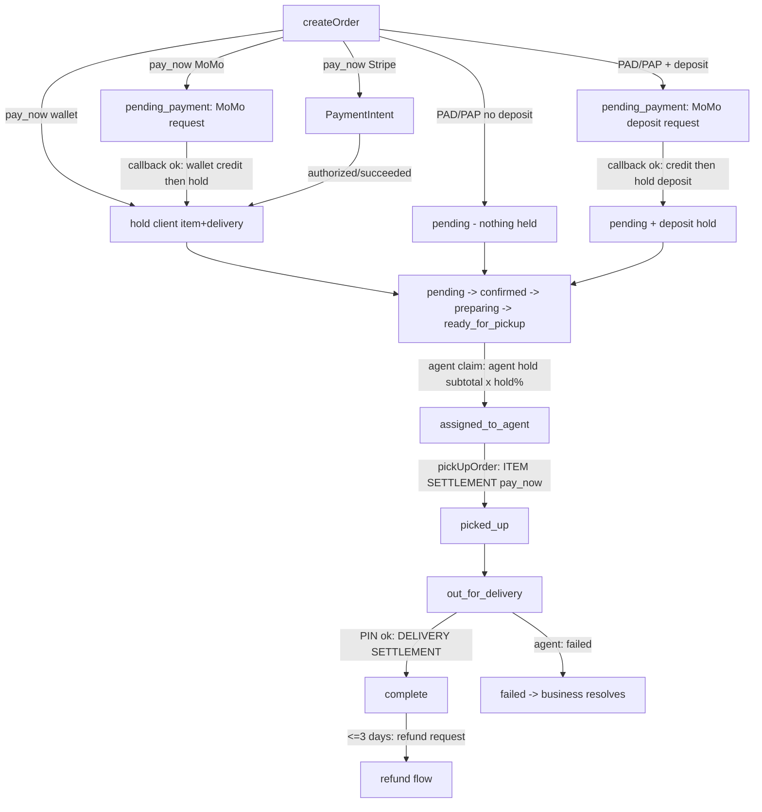
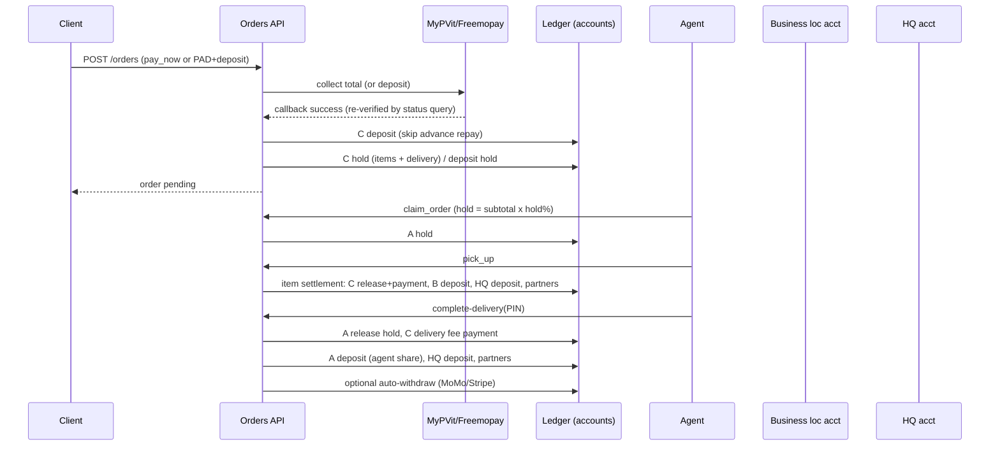
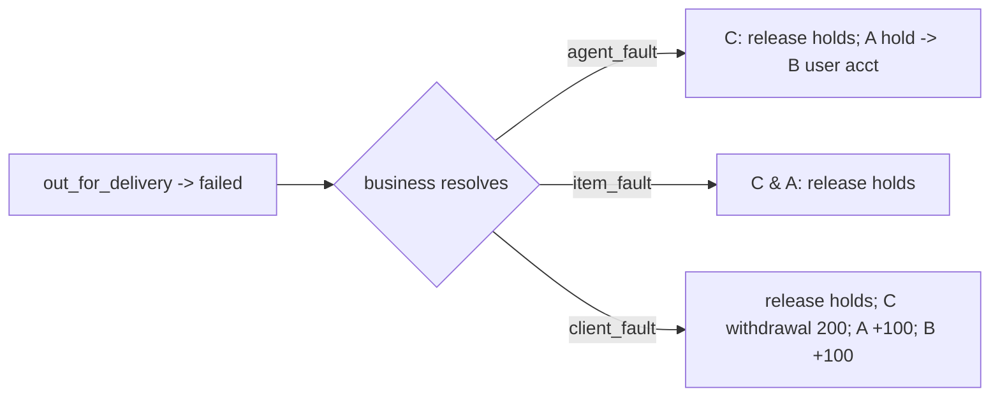
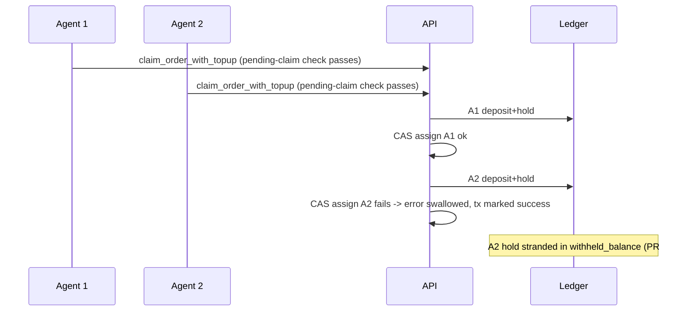
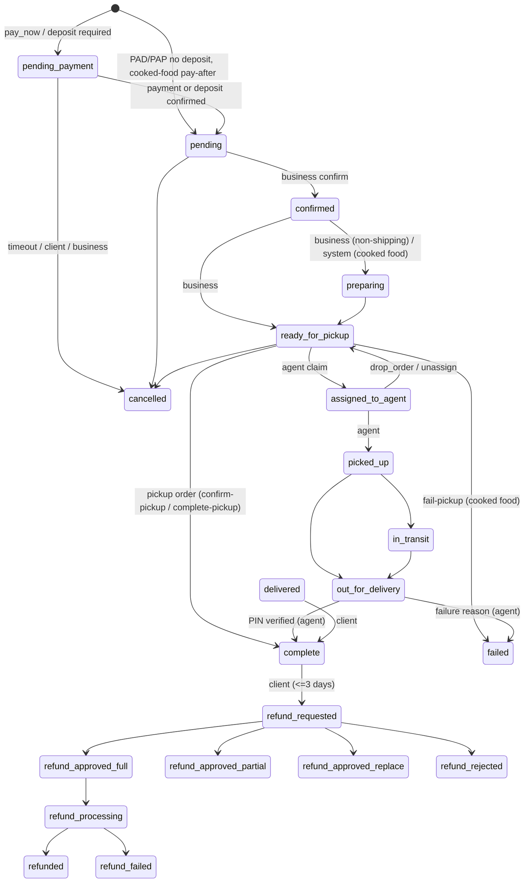

# Rendasua Platform Capabilities & Money Flows (living document)

> **Status:** generated from a read of the code, not from product specs.
> **Last verified:** 2026-10-03 for platform performance metrics on `/admin/performance`, the pay-after MoMo finalize hold fix (NODE-NESTJS-3F), and the mobile business dashboard pending-payment card. Body baseline remains `B-T-Group/renda-sua` `main` @ commit **`64c13d6c91b839276c8f60ddbe4d2f3bea63d8c9`** ("fix(orders): do not move uncollected waived delivery fees (#397)", 2026-10-01 07:45 ET).
> **Owner (document):** Samuel Besong (`besongsamuel`). Per-area owners are not recorded anywhere in the repo — see [Open questions](#open-questions).

> **Stale-claims warning:** sections below were written at `64c13d6`. Where they conflict with the "Changes since" table, **the table wins**. Section-by-section refresh is still pending.

### Changes since `64c13d6` (merged to `main` up to `9c3435b`, 2026-10-01)

| PR | Issue | Change | Sections of this doc now stale |
|---|---|---|---|
| mobile pending payment card | – | **Business dashboard active-order card (mobile):** a confirmed pay-after order that is still unpaid shows "Pending payment" (title, subtitle, and button) and opens the order. It no longer offers Ready / mark-ready. Once payment is paid or authorized, Ready returns. Classic pay-at-delivery and pay-at-pickup are unchanged. | §2.2 Orders |
| platform performance | – | **`/admin/performance` shows platform results for the selected period and market (web only):** order counts (total, completed, cancelled, failed, refunds, in progress, awaiting payment, completion and cancellation rates, unique customers, delivery/pickup/shipping split), per-currency GMV vs collected sales, payout breakdown (platform revenue, agent delivery pay, partner commissions, merchant payouts, referral compensation, funded delivery), and the top 5 stores with their referrer. Custom date range added. Mobile `AdminPerformance` is unchanged (enrollment + agents only). `GET /admin/performance/platform`. | §2.5 Analytics, Appendix D |
| NODE-NESTJS-3F | Sentry 7770650518 | **Pay-after MoMo success at `confirmed` holds instead of settling.** Callback load-by-number now selects `pay_after_merchant_confirm` / `is_cooked_food_pickup`. `finalizePayAtDeliveryPaymentAndComplete` re-reads the order and reroutes pay-after to the hold/prepare path. Classic PAD/PAP settlement is unchanged. | §3.4.5 |
| store links | – | **Store share links open the mobile app:** `https://rendasua.com/store/:id` is now claimed by the app (iOS `apple-app-site-association` `/store/*`, Android intent filter `/store/`) and routes to `StoreDetail` in any shell, including guests (`appDeepLink.ts`, `useAppDeepLinkNavigation.ts`). Without the app, the link still opens the web store. Android needs a new native build; iOS works once the web deploys plus an OTA update. | Client/guest browse (store page), Appendix D |
| #421 | – | Backend lint/test baseline restored (no behaviour change) | – |
| #409 | #404 | **Cancellation fee = `cancellation_fee_percent` % (CM 30, GA 30, CA 0) of item subtotal after discounts** (`max(0, total − collected delivery fee − tax)`), TS + lambda (`fee-percent.util.ts`, `cancellation_fee.py`). Flat `cancellation_fee` retired for cancellations but still read by **fail-pickup** (unchanged). `pay_at_delivery`/`pay_at_pickup` orders: no fee. Cooked-food `pay_after_merchant_confirm` orders (stored as `pay_at_pickup`/`pay_now`) keep the paid/authorized rule, so **carry the fee once paid**. | §3.4.7, §3.2, M12, M13 |
| #405 | #401 | **Client-fault failed delivery fee = `failed_delivery_fee_percent` % of item subtotal after discounts** (replaces flat 200). Holds released first; debit capped at available; agent/business credited only what was debited; shortfall raises `reportMoneyAnomaly` (log + Sentry). | §3.4.8 (`client_fault` row), G-4 |
| #406 | #400 | **Settlement retry:** commission distribution failure no longer stamps `*_settlement_completed_at`; stage returns `queued_for_retry`, order completes, failure recorded on `order_holds`, cron (`order-settlement-retry.service.ts`) retries; `payCommission` throws on missing account/rejected deposit and dedupes already-paid recipients. | M4, M5, G-3 |
| #407 | #399 (part 1) | **Atomic wallet balances:** `applyLedgerEntry` uses a guarded Hasura `update_accounts … _inc` (funds check in the `WHERE`), reverts on ledger-insert failure. Ledger idempotency keys are **not** done. Lambda `accounts_service.py` unchanged. | §3.1, M6, G-2 (partly) |
| #408 | #402 | **Waived delivery fee:** HQ platform account funds only the agent's pay (`allowNegative`); partners get 0; audit rows `commission_payouts.commission_type=platform_funded_delivery`. No negative-HQ alert. | M1, G-11 |
| #411 PR | #411 | **Pay-after refactor, no behaviour change for existing orders:** single predicate `resolvePayAfterConfirm` (`food/pay-after-confirm.util.ts`) shared by `createOrder` and checkout preflight; `confirmOrder` requests payment from `orders.pay_after_merchant_confirm` alone (not the cooked ready-in cohort); auto-prepare, business-cancel block and fail-pickup eligibility key on cooked line snapshots (`isCookedFoodOrderSnapshot`); new cron `UnpaidPayAfterSweeperService` (every 10 min) cancels confirmed-unpaid pay-after orders whose unpaid-cancel timer never fired (timer + 15 min). | §3.4.5, §3.4.7, Appendix D |
| #412–#414 PR | #412 #413 #414 | **Per-location `pay_at_confirm` (default off):** `business_locations.pay_at_confirm` (owner-only in Hasura + `PATCH business-items/locations/:locationId`, no admin override) and kill switch `application_configurations.pay_after_confirm_location_flag_enabled` (global, default false). With switch on, ANY line from a flagged location makes the whole ASAP MoMo pickup/delivery order pay-after (`orders.pay_after_merchant_confirm`, no deposit, MoMo pay-before-delivery allowed even if `momo_pay_now_delivery_enabled` is off, scheduled windows rejected `PAY_AFTER_CONFIRM_ASAP_ONLY`). Wallet-covered clients pay immediately; shipping / rentals / Stripe / diaspora unchanged. Non-cooked pay-after orders: confirm requests payment, unpaid auto-cancel after 45 min (`ORDER_PAY_AFTER_GOODS_UNPAID_CANCEL_MINUTES`, cooked keeps 3 h) releasing stock, no auto-prepare/auto-ready, store may cancel after paid (full refund), client cancel after paid carries the % fee. Create response now returns `pay_after_merchant_confirm`. | §1.4, §3.4.5, §3.4.7, App. C/D |
| #418 PR | #418 | **Settings toggle for `pay_at_confirm`:** web `LocationModal` and mobile `BusinessLocationFormScreen` show an owner-only switch (edit mode only, hidden for Stripe-rail locations and when an admin views another business; EN/FR copy under `business.locations.payAtConfirm*`). Sent via `PATCH business-items/locations/:id`; `GET business-items/locations` now returns `pay_at_confirm`. Create-location does not accept the flag. No effect while the kill switch is off. |
| #420 PR | #420 | **Runbook:** `docs/pay-at-confirm-rollout.md` — deploy order, pilot enablement SQL, monitoring queries, rollback (kill switch), support table, go/no-go criteria. Docs only. |
| #415 PR | #415 | **Web checkout for pay-after (`CheckoutPage`, `PlaceOrderPage`):** navigation now uses the **create response's** `pay_after_merchant_confirm` (not the stale preflight) for the awaiting-payment/confirmation screens; schedule picker hidden (window cleared) for any ASAP-only/pay-after cart; deposits hidden; generic "store" EN/FR copy (`orders.payAfterConfirm.*`, `orders.pickup.storePayAfterConfirmHint`, `orders.deliveryTimeWindow.storeAsapPayAfterConfirm`) when any group is not all-cooked (preflight group field `all_cooked_food`, new); order banner shows store wording, "Pay by HH:MM" (confirm + 45 min) for unpaid goods, pay CTA → existing `retry-payment` flow. Cooked flows keep kitchen wording. Cancel-reason chip filter on ready orders now keyed on cooked snapshot. |
| #416 PR | #416 | **Mobile checkout for pay-after (`CartCheckoutScreen`, `PlaceOrderScreen`):** `useCheckoutOrchestrator` surfaces the **create response's** `pay_after_merchant_confirm` (`payAfterConfirm` on the outcome); screens navigate on it (not the stale preflight) so flagged goods go to `OrderPlacedSuccess` (unpaid) instead of the MoMo await screen. Generic "store" EN/FR copy via `payAfterCopyVariant` (from preflight `all_cooked_food`): success chip/next steps, ASAP helper, order banner (`orders.nextStep.payAfter*`), "Pay by HH:MM" (confirm + 45 min). Retry/pay prompt after confirm uses the existing summary-card retry-payment. Cooked wording unchanged. Agent "collect payment" already suppressed for `pay_after_merchant_confirm` orders (covered by new tests below). |
| #417 PR | #417 | **Business confirm UI (web + mobile) for flagged-location goods:** new `isStorePayAfterConfirmOrder` / `shouldUseGuidedConfirmModal` predicates open the guided confirm dialog (`CookedFoodConfirmOrderModal` / `CookedFoodConfirmOrderDialog`) for non-cooked ASAP pay-after orders in a **store variant** (no ready-in prompt, no `ready_in_minutes` sent; copy explains the client is asked to pay by MoMo, 45-min unpaid auto-cancel + stock release; then a wait-for-payment step). Used by order actions, incoming-order interrupt/overlay, kitchen mode, active-order CTA. `isCookedFoodPayAfterPaid` / ready-fail / start-cooking priority are now **cooked-snapshot only**, so the store **can cancel a paid non-cooked pay-after order** (client refunded in full; notice shown in the cancel dialog on web + mobile); cooked pay-after behaviour unchanged. WhatsApp/batch confirm already work without ready-in (backend default). EN/FR `orders.payAfterConfirm.business.*`. |
| #419 PR | #419 | **Storefront badge "Pay after the store confirms" (optional):** catalog items (`GET /inventory-items`, store/item detail payloads) carry `pay_after_confirm_badge` = location `pay_at_confirm` ∧ kill switch `pay_after_confirm_location_flag_enabled` ∧ not a Stripe-rail country (`isPayAfterConfirmBadgeVisible`; kill-switch read fails closed). Shown as a chip on web `DashboardItemCard` and mobile `InventoryCatalogCard` (EN/FR `catalog.payAfterConfirmBadge`). Toggling `pay_at_confirm` bumps the catalog cache generation (`updateLocation`), so the badge follows the toggle within the cache refresh. No Hasura permission change (read through the backend system service). |
| #414 tests PR | #414 | **Pay-after tests, frontend/mobile/e2e leftovers (no product change):** mobile `clientOrderJourney.test.ts` (flagged goods keep the delivery PIN despite `pay_at_delivery` timing; confirmed/pickup-ready stages) and an extra `orderPaymentAgentActions` case (no "collect payment" for flagged orders); the cooked/orderPhase/payAfterConfirm/businessOrderActions specs ship with #415–#417. `e2e/full-order-lifecycle.spec.ts` gains a skipped-by-default flagged-location describe (client places pay-after order without paying now; business store-variant confirm) enabled via `E2E_PAY_AT_CONFIRM_SEARCH`. MoMo sandbox UAT remains manual. |
| #436 PR | – | **Pay-at-confirm UX/copy follow-ups (web + mobile, no backend change):** (1) client cancel of a store-confirmed **unpaid** pay-after order shows free-cancel copy (`orders.payAfterConfirm.cancelUnpaid`) instead of the "Cancellation Fee" title / "Net refund" wallet badge (helper `isUnpaidPayAfterOrder`); mobile Mobile-Money processing-time note (`mobile_money_provider`) now says refunds go to the Rendasua wallet immediately. (2) `OrderPhaseBanner` "Pay by" uses the app language (24h FR / 12h EN), `tomorrow`/`demain` prefix when the date differs, clock icon + bold time, warning colour at ≤10 min, and `orders.payAfterConfirm.payByExpired` once past the deadline. (3) Business wait step uses `orders.payAfterConfirm.business.viewOrders` (not kitchen `viewOrdersToCook`) and links to the Prep queue — `/orders?queue=prep` is now honoured on web, `BusinessOrdersList { queue }` on mobile. (4) Web `CancellationReasonModal`: secondary button "Keep order"; confirm dialogs (web + mobile) use "Back"; `cancelPaidRefund` says the client is refunded in full **to their Rendasua wallet**; shorter `confirmHint`. (5) Copy: exact "45 minutes" (no "about"), FR grammar ("pour que le magasin/la cuisine puisse…"), whole-order sentence on the checkout hint (`storeAsapPayAfterConfirm`), reassurance in `payBy`, new `orders.payAfterConfirm.storeNoConfirm` (60 min = 45 SLA + 15 grace), mobile FR chip "Paiement après confirmation", a11y labels on the mobile success chip / next-steps card. Timings unchanged (store confirm clock separate from the client's 45-min pay window; no fee for unpaid pay-after cancel; store cancel of a paid order refunds to the wallet). | §1.4, §3.4.5, §3.4.7 |
| #390 | – | **Claim race fix:** assign first (compare-and-swap), hold only after the agent owns the order; a lost claim leaves the top-up as wallet credit and marks the payment `CLAIM_ORDER_TAKEN` (web + mobile show "no longer available"). | G-1 (#391 was closed unmerged) |
| order alert sound | – | **Mobile order alerts play a repeating in-app chime** (`orderAlertSound`, `assets/sounds/order-alert.wav`) while the incoming-order or delivery-offer screen is open, including when the ringer is silent. Android backup pushes use new channels `order_incoming_alarm` and `order_offers_alarm` (alarm audio stream). Needs a new native build for `expo-audio`. | §2.2 Orders, §2.3 Find work |
| location settings redesign | – | **Business location settings UI (web + mobile, no backend/Hasura change):** web route `/business/locations/:locationId` is a summary ("what customers will experience") plus sections that save on their own. Create stays a short `LocationModal` (name, address, Mobile Money or phone). Getting paid shows the Mobile Money number only; Stripe locations keep the fee line and do not show a payout phone. Invalid location type `showroom` removed; `pickup_point` is offered. List cards drop commission, balance, and the stats strip. Business-wide order timing and pause move to "For all your locations" (web panel; mobile Insights). `pay_at_confirm` stays owner-only, edit-only, and hidden on Stripe. Copy states 45 minutes for goods, 3 hours for cooked food, and no scheduling, plus a gradual-rollout footnote because the client cannot read the kill switch. Making a location main sets the new one then clears the previous one in the app. | §1.3 Locations |
| web location MoMo remove | – | **Getting paid Remove unlinks this location only:** web `GettingPaidSection` no longer calls `DELETE /mobile-payment-phones/:id` after the location PATCH. Registry delete unlinked every location (and the agent profile) that shared the number. Matches mobile list unlink. Delete the number from payment-phone management if the merchant wants it gone everywhere. | §1.3 Locations |
| #438 | #438 | **Keyed deposit remainder:** a retry of an idempotency-keyed deposit no longer treats the cash-advance `:repay` row as proof the whole deposit finished. Only the original key short-circuits; if just `:repay` exists, the unpaid remainder is credited (a repayment that consumed the full amount stays done). | §3.1 |
| location settings payout | – | **Stripe auto-payout stays on when a location section is saved.** Web location settings and mobile name/phone saves no longer set `auto_withdraw_commissions` to false as a side effect. That flag also triggers the Stripe Connect payout after a commission credit. Mobile create of a Stripe location omits the flag so the database default (true) applies. | §3 payouts |

Not yet reflected anywhere in the body: per-section text, the Appendix C flag list (new config key `cancellation_fee_percent`, `failed_delivery_fee_percent`), and the Appendix D file index (`fee-percent.util.ts`, `order-settlement-retry.*`, `common/utils/money-alert.util.ts`).

---

## 0. Purpose and how to maintain this document

### 0.1 Purpose
One place that answers: *who can do what on Rendasua (web vs mobile)*, *who is paid what and when*, and *what is broken / missing today*. Every claim carries a file pointer so it can be re-verified. Claims are tagged:

| Tag | Meaning |
|---|---|
| **[V]** | Verified by reading the cited code/migration at the commit above |
| **[I]** | Inferred from code structure or naming; behaviour not exercised |
| **[?]** | Could not be determined from the repo (see Open questions) |

### 0.2 Update-with-PR checklist
Update this file **in the same PR** whenever a PR touches any of the following:

- [ ] A controller route (`apps/backend/src/**/*.controller.ts`) — add/remove the row in the persona section (regenerate the route list, see 0.3).
- [ ] Money code: `orders/orders.service.ts`, `orders/order-status.service.ts`, `commissions/*`, `accounts/accounts.service.ts`, `orders/deposit-*.ts`, `orders/failed-deliveries.service.ts`, `orders/order-refunds*.ts`, `rentals/rentals.service.ts`, `mobile-payments/*`, `stripe-payments/*`, `payment-programs/*`, `cdk/src/lambda/order-status-handler/*`, `cdk/src/core-packages/**/commission_handler/*` — update §3 tables, diagrams, and the "configurable vs hardcoded" table.
- [ ] A migration that seeds/changes `application_configurations`, `delivery_configs`, `country_delivery_configs`, `partners` — update the flag/config tables (§1.4, Appendix C).
- [ ] A new `order_status` enum value or transition — update Appendix B.
- [ ] A new web route (`apps/frontend/src/app/app.tsx`) or mobile screen/navigator (`apps/mobile/src/navigation/*`) — update web-vs-mobile columns.
- [ ] Closing/opening a gap issue or PR — update §4 (Gaps) and the "last verified" line.
- [ ] Re-fetch prod flags: `curl https://prod.api.rendasua.com/api/app-config/client-flags` and update Appendix C.
- [ ] Any change to money or persona behaviour (who can do/see what, who is paid what and when, fees, holds, refunds) — update this file even if none of the paths above changed.
- [ ] Bump **Last verified** date + commit sha at the top.

### 0.3 How this was produced (reproducible)
```bash
git -C <repo> rev-parse HEAD                                  # commit sha
# route inventory (decorator scan of apps/backend/src/**/*.controller.ts) -> grouped by controller
# prod flags
curl -s https://prod.api.rendasua.com/api/app-config/client-flags
# open work
gh issue list -R B-T-Group/renda-sua --state open --limit 100
gh pr list    -R B-T-Group/renda-sua --state open
```
Use `git grep` on the working tree (a plain `rg` over `apps/backend` can be very slow). The GitHub code-search index is stale — do not use it.

### 0.4 Scope limits of this version
Read in depth: order creation, checkout rails, settlement, commissions, cancellation, failed delivery, refunds, deposits, claim/hold, wallet primitives, withdrawals (summary), rentals settlement, cash-advance service, schedules runner (summary), launch promo, delegations (summary), RBAC, flags, route inventories (backend/web/mobile). **Skimmed only:** reels internals, AI image cleanup, WhatsApp/Twilio, commerce integrations, assistant, analytics/site events, credit campaigns, representative compensation formulas, business-referral payout formulas. Those are listed by route/controller only and called out where money is involved.

---

## 1. Platform overview

### 1.1 Monorepo apps
| App | Path | Stack | Notes |
|---|---|---|---|
| Backend API | `apps/backend` | NestJS (~128 controllers), global prefix `/api` | Orders, wallet ledger, payments, notifications, admin |
| Web | `apps/frontend` | React SPA (routes in `src/app/app.tsx`, lazy pages in `src/app/lazy-routes.tsx`) | Client, business, agent, delegate, admin |
| Mobile | `apps/mobile` (`agent-mobile`, Expo SDK 55 / RN 0.83) | Expo; per-persona navigators in `src/navigation/*RootNavigator.tsx` | Thin client; Stripe PaymentSheet, push, background GPS are native-only (`apps/mobile/AGENTS.md`) |
| Hasura | `apps/hasura` | Metadata `metadata/databases/Rendasua/tables/*.yaml` (187 tables), ~410 migrations in `migrations/Rendasua/` | Inherited roles: `agent`, `anonymous`, `business`, `client`, `user` (`metadata/inherited_roles.yaml`) |
| CDK / AWS | `apps/cdk` | CDK + Python lambdas `src/lambda/*` + shared `src/core-packages/rendasua_core_packages` | SQS order events → `order-status-handler` (cancellation financials, Slack, agent notify); `wait-handler` (payment timeouts); `notify-agents`; `ai-image-cleanup`; `reel-*`; `business-referral-payouts`; `payment-schedule-runs`; `credit-campaign-signup`; `commerce-sync` |

### 1.2 Markets and currencies
- **Primary markets (MoMo rail, XAF):** Cameroon (CM), Gabon (GA). Seeded additionally: TG, BJ, CI, CG (`1788043042285_seed_countries_tg_bj_ci_cg`) — **[V]** seeds exist; whether they are live is **[?]**.
- **Card rail (Stripe):** default enabled countries `CA,US,PH` (`STRIPE_ENABLED_COUNTRIES`, `apps/backend/src/config/configuration.ts`); CA/PH seeded in `20260624160000_seed_country_ca_data`, `1789125017197_seed_country_ph_data`. Env-dependent in prod **[?]**.
- **Diaspora checkout:** payer in a Stripe country buying from a MoMo-country seller pays by card (Stripe); the platform balance is credited; FX is **display-only** (`diaspora/fx-estimate.service`, env `DIASPORA_FX_RATES`); only `pay_now` allowed (`assertDiasporaPaymentTiming`). Env gate `DIASPORA_CHECKOUT_ENABLED` (default on unless `'false'`), `DIASPORA_PAYER_COUNTRIES` (empty ⇒ reuse Stripe list). **[V]** code; prod env **[?]**.
- **Rail resolution:** `PaymentRoutingService.resolveOrderRail` — seller country decides; Stripe only for configured countries with an active `supported_payment_systems` row. **[V]**
- **Mobile-money providers:** MyPVit, Freemopay (callbacks `POST /mobile-payments/callback/{mypvit,freemopay}`), plus MTN/Orange/Airtel/Moov adapters; chosen by `mobilePaymentsService.getProviderForCountry`. **[V]**
- Currency-country map used by cancellation policy is hardcoded to GA/CM/CA/US only (`COUNTRY_CURRENCY_MAP`) — see gaps.

### 1.3 Personas (what "user type" means)
| Persona | How it is modelled | Evidence |
|---|---|---|
| **Client** | `clients` row; persona id `client` | `users/persona.types.ts` (`'client' \| 'agent' \| 'business'`) |
| **Business (merchant)** | `businesses` row (+ `business_locations`, each with its own wallet account) | same |
| **Agent (delivery)** | `agents` row; `is_verified`, `is_internal`, status (e.g. `suspended`) | same; `orders.service.ts claimOrder` |
| **Delegate (location manager)** | `location_delegations` rows (invite → accept), roles/permissions tables; header `x-active-delegation` | `delegations/delegation.constants.ts`; mobile `DelegateRootNavigator.tsx`; web `/delegate/orders*` |
| **Admin / internal ops** | Platform RBAC roles, not a persona: superuser, moderator, finance, support, content, order_manager, whatsapp_manager | `rbac/platform-permissions.ts` |
| **Guest / anonymous** | Hasura `anonymous` role; mobile `GuestRootNavigator`; web public routes; `POST /orders/checkout/preflight` is `@Public()` | `orders.controller.ts`, `GuestRootNavigator.tsx` |
| **Partner** | `partners` / `partner_businesses` tables; receive a % of Rendasua's item and delivery commission | `commissions.service.ts` `getActivePartners`; admin `payment-programs/partners` |
| **Representative** | `representative-compensation` module | `representative-compensation/README.md` (formulas not read) |
| **HQ account** | user `hq@rendasua.com` receives platform revenue | `commissions.service.ts` **[V]** (email constant) |

**Active persona resolution:** a user can enroll in several personas (`POST /users/me/personas/:persona`) and switches with `POST /users/me/active-persona`. Backend resolves the active persona from the `X-Active-Persona` header if the user has that profile **and** the JWT's allowed roles include it, else from `x-hasura-default-role` (`users/persona.util.ts resolveSessionPersona`). Business logic uses `requireActivePersona(user,'client'|…)`. See `docs/auth0-active-persona-jwt.md`.

### 1.4 Feature flags and config switches
Three different mechanisms — don't confuse them:

**A. Client flags** (exposed by `GET /api/app-config/client-flags`, `@Public`, throttled 120/min, optional `?country=`). Keys are an allowlist in `app-config/client-flags.constants.ts`; resolved by `app-config.service.ts` from `application_configurations` (`boolean_value`, optional `country_code` override, `status='active'`), 30 s in-memory cache. Defaults are `false`, except `reorder_v1` and `catalog_experience_v1` which default to `NODE_ENV !== 'production'`. Web hook `frontend/src/hooks/useClientFlags.ts`; mobile `mobile/src/services/clientFlagsApi.ts` + `contexts/ClientFlagsContext.tsx`. Prod values: see [Appendix C](#appendix-c--flag--config-table).

**B. Server-side `application_configurations` switches** (not exposed to clients): `momo_pay_now_delivery_enabled` (per fulfilment country, **default false** when row missing — `orders.service.ts isMarketFlagEnabled` ~L10152, `checkout-preflight.service.ts` ~L1446), `location_delegations` (`delegations/location-delegations-flag.service.ts`), `merchant_agreement_provider`, `mobile_money_verification_method` (`question` | `transaction`, default `question`; `mobile-payment-phones.service.ts`), `business_referral_payout_enabled`, `rembg_cleanup`, loyalty/launch-promo/commission/cancellation keys (see Appendix C). Prod values **[?]** (endpoint does not expose them).

**C. Environment flags** (`apps/backend/src/config/configuration.ts`): `STRIPE_ENABLED_COUNTRIES`, `STRIPE_MANUAL_CAPTURE_ENABLED/_COUNTRIES`, `STRIPE_TAX_ENABLED/_COUNTRIES`, `STRIPE_AUTH_EXPIRY_GRACE_HOURS` (24), `STRIPE_AUTHORIZED_NO_AGENT_TIMEOUT_HOURS` (48), `DIASPORA_*`, `REFUNDS_V2_ENABLED` (default true), `merchantLifecycle.checkoutGateEnabled`, `order.paymentTimeoutWaitMinutes` (default 10).

> Flag semantics **[V]** (grep of consumers):
> - `reels_enabled` — mobile tabs in Client/Guest/Business navigators + business dashboard + item detail; **no web consumer found** besides the hook type and admin reel pages. Backend gates per-merchant via `businesses.reels_enabled_allowlist` (`reel-ai-generate.service.ts`, `merchant-engagement-eligibility.ts`).
> - `reels_comments_enabled` — mobile `ReelOverlay.tsx` only.
> - `reels_merchant_allowlist_only` — present in flag allowlist and clients' types; **no consumer found in the code I searched** besides types **[I]**.
> - `floating_nav_enabled` — mobile Client/Business navigators + `tabBarGeometry`.
> - `reorder_v1` — `useClientReorderFlow` on web and mobile (`POST /orders/:id/reorder`).
> - `catalog_experience_v1` — web `ItemsPage.tsx`, mobile `BrowseCatalogScreen.tsx`.
> - `auth_web_inapp_gates` — web only: `OtpAuthPage.tsx`, `AuthGateContext.tsx`, auth-funnel tracking.

---

## 2. Persona capabilities

Legend: **W** = web (`apps/frontend`), **M** = mobile (`apps/mobile`), **B** = backend route(s). "W+M" = both. Route inventories come from `apps/frontend/src/app/app.tsx` and `apps/mobile/src/navigation/*RootNavigator.tsx`; backend routes from the `*.controller.ts` files (≈944 routes).

### 2.0 Cross-persona (auth, profile, notifications, support, messaging)

| Area | Capability | Surface | Pointers |
|---|---|---|---|
| Auth | Login/signup via phone/email OTP; Auth0 still used for web Universal Login unless `auth_web_inapp_gates` (off in prod) | W: `/auth/login`, `/auth/otp`, `/signup`; M: `LoginScreen`, `OtpVerificationScreen`, `SignupScreen`; B: `auth/*`, `twilio-verify/{start,verify}` | `frontend/src/components/pages/OtpAuthPage.tsx`; issues #227–#230, #338, #364 |
| Multi-persona | Enroll an additional persona, switch active persona | W: `/select-persona`; M: `EnrollPersona{Explain,Setup,Success}Screen`, `PersonaSessionGate`; B: `POST /users/me/personas/:persona`, `/users/me/active-persona`, `/users/me/active-context` | `users/users.controller.ts`, `users/persona.util.ts` |
| Saved accounts / biometrics | Multi-account sign-in with refresh tokens in secure store | M only (native) | `mobile/AGENTS.md`, `SavedAccountsScreen` |
| Profile | Edit profile/phone/email/photo; request account deletion | W: `/profile`, `/profile/delete-request`, `/complete-profile`; M: `ProfileScreen`, `AccountManagementScreen`; B: `/users/me/{update,update-email,phone,delete}` | `users.controller.ts` |
| Documents | Upload ID / documents (presigned S3) | W: `/documents`; M: `DocumentsScreen`; B: `/uploads/*` | `uploads/uploads.controller.ts` |
| Notifications | Preferences, push tokens, notification center | W: `/settings/notifications`; M: `NotificationPreferencesScreen`, `NotificationsScreen`, `NotificationPermissionScreen`; B: `notifications/*`, `mobile_push_tokens`, `push_subscriptions` (PWA) | `notifications/notifications.service.ts` (SMS/WhatsApp/push/email) |
| Messaging | Threads with ops/support; order-scoped chat with quick templates and delivery-PIN messages | W: `/messages`, `/orders/:id/messages`; M: `MessagesScreen`, `ThreadDetailScreen`, `OrderMessages`; B: `/threads`, `/orders/:id/messages*` | `threads/`, `messaging/` |
| Support | Support tickets; AI assistant; FAQ | W: `/support`, `/support/tickets`, `/assistant`, `/faq`; M: `SupportTicketsScreen`, `AssistantChatScreen`, `FAQScreen`; B: `/support/tickets*`, `assistant/*` | `support/support.controller.ts` |
| Wallet | Account balances, transactions; MoMo phones; withdrawals; Stripe Connect for card-rail sellers | W: `/accounts`; M: `UserAccountsScreen`, `ConfigurePaymentsScreen`, `UserMobilePaymentPhonesScreen`; B: `/accounts*`, `/mobile-payments/*`, `/mobile-payment-phones/*`, `/stripe-connect/*`, `/stripe-payments/withdraw` | see §3 |
| Payment programs | Cash advance draw, payment schedules, purchase credits | W: `/accounts/cash-advance`, `/accounts/schedules*`, `/accounts/credits`; M: `UserPaymentProgramsScreen`, `PaymentScheduleDetailScreen`, `UserPurchaseCreditsScreen`, `CashAdvanceDrawSuccessScreen`; B: `/payment-programs/*` | `payment-programs/*` |
| Ratings | Rate order/agent/rental after completion | W+M (order detail); B: `/ratings*` | `ratings/ratings.controller.ts` |

### 2.1 Client (customer)

**Guest browsing (not logged in)** — W: public routes `/`, `/items`, `/items/:id`, `/foods`, `/stores`, `/store/:businessId`, `/categories`, `/collections*`, `/deals`, `/exports`, `/rentals`, `/rentals/:listingId`, `/cart`; M: `GuestRootNavigator` (`GuestBrowse`, `GuestRentals`, `GuestFoods`, `GuestReels` [flag], `GuestAuth`, `GuestTabs`, `Cart`, `StoreDetail`, `InventoryItemDetail`, `RentalListingDetail`). **[V]**
- Guest checkout preflight: `POST /orders/checkout/preflight` is `@Public()` (`orders.controller.ts`; `checkout-preflight.service.ts`). W has an anonymous-address flow: `/items/:id/place_order/anon-address` (`AnonAddressPage.tsx`, `?anon=1`). **[V]** whether a guest can actually *place* an order without signing in: `POST /orders` is client-persona only (`orders.service.ts createOrder`) ⇒ **sign-in is required to order [V]**; the gate is the `AuthGateContext` (flag-controlled on web).

| Area | Capabilities | W | M | Backend / pointers |
|---|---|---|---|---|
| Browse / discovery | Items, categories, collections, stores, deals, food menu, exports ("export_available" items → submit interest instead of buying), search, likes (favourites), follow stores | `/items`, `/foods`, `/stores`, `/deals`, `/exports`, `/likes` | `ClientBrowse`, `ClientFoods`, `StoresList`, `UserLikes`, `CategoriesBrowse`, `CollectionDetail` | `marketplace-public`, `item-likes`, `business-follows`, `collections`, `item-deals` |
| Catalog experience v1 | Curated rails/stops on the items page | `ItemsPage.tsx` | `BrowseCatalogScreen.tsx` | flag `catalog_experience_v1` (**on in prod**) |
| Reels | Vertical product video feed, like, view; comments | **no web feed route found [V]** (`/admin/reels/*` only) | `ClientReels` tab, `ReelOverlay` | `reels/reels-feed.controller.ts`, flags `reels_enabled` (on), `reels_comments_enabled` (**off**) |
| Rentals (renter) | Browse rental listings, request / book, pay (Stripe auth incl. security deposit; MoMo = reserve & pay at pickup), start-PIN handover, return, rate | `/rentals*`, `/rentals/requests`, `/rentals/bookings/:id` | `ClientRentalsHome`, `RentalListingDetail`, `ClientMyRentals`, `RentalBookingDetail`, `RentalRateBooking` | `rentals/rentals.controller.ts` |
| Product interest | Submit interest for `export_available` items (lead only, no payment) | `/product-interest` | `ClientProductInterest` | `product-interest/*` |
| Cart & checkout | Multi-item cart per business; delivery / pickup / shipping; recipient (third-party) with PIN SMS; address book; discount code; purchase-credit plan; first-order promo | `/cart`, `/checkout`, `/items/:id/place_order` | `Cart`, `CartCheckout`, `PlaceOrder`, `ManageRecipients` | `orders.controller.ts POST /orders`, `GET /orders/discount-codes/validate`, `recipients/*`, `addresses/*` |
| Payment — wallet | Pay now from wallet when `available_balance ≥ total` | W+M | W+M | `createOrder` wallet branch |
| Payment — MoMo | Pay now (if market flag), pay at delivery / pickup with optional reservation deposit, retry payment/deposit | `/orders/awaiting-payment` | `MobileMoneyAwaitingPayment` | `retry-payment`, `retry-deposit-payment`; flag `momo_pay_now_delivery_enabled` |
| Payment — card (Stripe) | Card pay-now (CA/US/PH sellers), diaspora card payment for MoMo-country sellers; manual capture for pickup/shipping | `/payment/return`, `/payment/success` | Stripe PaymentSheet (**native only**) | `stripe-payments/*`, `diaspora/*`, `PaymentRoutingService` |
| Order tracking | Status timeline, events, delivery PIN, cancel, switch-to-pickup (when no agent found), reorder | `/orders`, `/orders/:id`, `/orders/confirmation` | `ClientOrders`, `OrderDetail`, `OrderPlacedSuccess` | `GET /orders*`, `GET /orders/:id/delivery-pin`, `POST /orders/cancel`, `/switch-to-pickup`, `/:id/reorder` (flag `reorder_v1`, **on**) |
| Cancellation | Cancel before an agent is assigned; fee preview | W+M | W+M | `GET /orders/:id/cancellation-preview`, `GET /orders/cancellation-fee` |
| Refunds | Request refund ≤3 days after completion; upload evidence; return flow | W order page | `OrderDetail` | `order-refunds.controller.ts` |
| Loyalty | First-order discount code (default 5 %), referral credits | W+M | W+M | `loyalty/loyalty.service.ts`, `referrals/*` |
| Wallet / credits | Wallet balance, top-up via MoMo/card, purchase-credit plans, withdrawal to MoMo (CM/GA numbers) | `/accounts`, `/accounts/credits` | `UserAccounts`, `UserPurchaseCredits` | §3 |

### 2.2 Business (merchant)

| Area | Capabilities | W | M | Backend / pointers |
|---|---|---|---|---|
| Onboarding & verification | Merchant agreement acceptance (PDF), ID approval, payment-account setup (MoMo phone verification / Stripe Connect), lifecycle status gating `can_accept_orders` | `/business/merchant-agreement`, `/connect/onboarding/*`, `/business/onboarding/*` | `BusinessMerchantAgreement`, `BusinessSetupStepSuccess`, `BusinessConfigurePayments`, `BusinessMobilePaymentPhones` | `business-verification/*`, `mobile-payment-phones/*`, `stripe-payments/stripe-connect.controller.ts`, `merchant-lifecycle` |
| Catalog | Items (+variants, images, tags, collections), CSV upload, add-from-image (AI), AI image cleanup (rembg / OpenAI), AI proposals, promotions, deals (`item_deals`), per-location inventory & price overrides | `/business/items*`, `/business/images`, `/business/ai-tokens`, `/business/dashboard/catalog-menu` | `BusinessItemsList`, `BusinessItemForm`, `BusinessAddItemFromImage`, `BusinessAiImageCleanupReview`, `BusinessItemAiProposal`, `BusinessCatalogTab` | `business-items/business-items.controller.ts`, `business-tokens/*` (AI tokens purchase), `ai-image-cleanup/*` |
| Item-level payment options | `pay_on_delivery_enabled`, `pay_at_pickup_enabled`, `shipping_enabled` + `shipping_price`, `initial_deposit_enabled` + percent (1–25), `export_available`, `max_order_quantity` | item form (W) | `BusinessItemFulfillment` (M) | migration `20260926201000_item_initial_deposit_opt_in`; `deposit-calculation.service.ts` |
| Locations | Multiple locations (each has its own wallet account), **Set hours** on each location card (opens the hours editor), pause/busy mode (business-wide, under "For all your locations"), location **transfer**, Getting paid Mobile Money number (hidden on Stripe; fee line remains), owner-only `pay_at_confirm` (edit-only, hidden on Stripe; 45 min goods / 3 h cooked food, no scheduling) | `/business/locations`, `/business/locations/:locationId` | `BusinessLocationsList`, `BusinessLocationForm` (summary + sections; create is short), `BusinessLocationHours` | `business-items` (`locations*`, `transfer-requests*`), admin `location-transfers`. No new endpoints. |
| Team / delegation | Invite location delegates (`order_manager` assignable; `catalog_manager`, `location_manager` exist but **not assignable in v1**), resend/revoke | `/business/team` | `BusinessTeam` | `delegations/business-delegations.controller.ts`; flag `location_delegations` |
| Orders | Accept/confirm, prepare, ready for pickup, remind-ready, busy mode, batch complete-preparation, cancel (early statuses), pickup confirm via PIN, shipping (mark-shipped, tracking), kitchen mode (cooked food), label/receipt PDFs. Mobile incoming-order screen loops an alert chime until the merchant acts | `/orders`, `/orders/batch`, `/kitchen`, `/open-orders`(agents) | `BusinessOrdersList`, `BusinessOrderDetail`, `BusinessPickupPaymentAwaiting` | `orders.controller.ts`; `pdf/*`; `orderAlertSound.ts` |
| Cooked food | Food settings per item/location, availability slots, ASAP only, pay-after-confirm MoMo, auto-prepare clock, `fail-pickup` | `/kitchen`, `/foods` (client) | order screens | `food/*`, `cooked-food-pickup-flow.service`, migration `20260925160000_cooked_food_pickup_flow` |
| Failed deliveries / pickups | Resolve agent-/client-/item-fault; failed pickups list | `/business/failed-deliveries`, `/business/failed-pickups` | `BusinessFailedDeliveriesList`, `BusinessFailedPickupsList` | `orders/failed-deliveries.service.ts`, `failed-pickups` |
| Refund requests | Approve full/partial/replace, reject, request info/return, mark received | `/business/refunds` | `BusinessRefundsList` | `order-refunds.controller.ts` |
| Rentals (owner) | Rental catalog, listings per location, publish, weekly availability, requests (respond), schedule calendar, bookings, start-PIN verify/overwrite, confirm return | `/business/rentals*`, `/business/rental-images` | `BusinessRentalsStudio`, `BusinessRentalItem*`, `BusinessRentalBookingDetail`, `BusinessRentalAddListing` | `rentals/rentals.controller.ts`, `rental-item-images/*`, `rental-listing-ai-review/*` |
| Reels | Create/upload/submit reels, AI-generated reels (token packs), boost (credits), my reels | **none** (no business reel routes in `app.tsx`) | `BusinessReels`, `BusinessAddReel`, `BusinessMyReels`, `BusinessReelAiTokens`, `BusinessReelAiSubmitted` | `reels/*`, `reel-ai-generate/*`, `reel-boosts/*`, `reel-ai-tokens/*`; per-merchant `businesses.reels_enabled_allowlist` |
| Product interest | See export leads | `/business/product-interest` | `BusinessProductInterest` | `product-interest/*` |
| Wallet & payouts | Per-location accounts; withdrawal to verified MoMo phone (PIN-protected `withdrawal_pin_enabled`); Stripe payouts (Connect); `auto_withdraw_commissions` | `/business/accounts` | `BusinessAccounts` | `mobile-payments`, `stripe-payments/withdraw`, `WithdrawalPinService` |
| Plan / commission tier | STANDARD / PREMIUM / ELITE (30-day lock) | `/business/account-type` | `BusinessAccountTypeScreen` | `business-items` `GET/PATCH business/account-type`; `commissions/business-account-type.ts` |
| Analytics | Dashboard aggregates, client cities, insights | `/business/analytics`, `/business/client-cities` | `BusinessInsights`, `BusinessClientCities` | `dashboard/*`, `analytics/*` |
| Referrals | Refer businesses/agents; weekly referral payout cron; referral review (admin) | – | `BusinessReferredBusinesses` | `business-referral-payouts/*`, `referrals/*` |
| Integrations | Commerce integrations (Facebook catalog feed, sync runs/webhooks) | `/business/integrations` | – | `commerce-integrations/*`, lambda `commerce-sync` |
| Launch promo | First N businesses per country get 0 % item commission for M settled orders | – | – | `launch-promo/launch-promo.service.ts` (CM/GA seeds: 150 businesses, 15 orders, 30-day identification window) |

### 2.3 Agent (delivery agent)

| Area | Capabilities | W | M | Backend / pointers |
|---|---|---|---|---|
| Onboarding | Landing, signup, ID document upload (`id_card`/`passport`/`driver_license`), AI ID pre-review, admin approval; MoMo phone verification (question or small transaction); `complete_onboarding` | `/become-a-delivery-agent`, `/documents` | `Documents`, `ConfigurePayments`, `MobilePaymentPhones` | `agents.controller.ts POST complete_onboarding`; `uploads/*`; `id-document-ai-review/*`; `services/upload.service.ts` (~L630–660); `mobile-payment-phones.service.ts maybeVerifyAgent` |
| **Verified status** | `agents.is_verified` becomes true when an **approved ID** exists **and** a **verified MoMo phone** exists (also set on ID approval by `shouldMarkAgentVerifiedOnIdApproval`); `claim` requires `is_verified` (`AGENT_NOT_VERIFIED`) | – | – | **[V]** `mobile-payment-phones.service.ts` L736+, `orders.service.ts assertAgentVerifiedForClaim` |
| Availability & tracking | Availability toggle, focus area, background location tracking with consent (mobile consent required to claim) | web dashboard | `AgentLocationTracking`, `Dashboard` | `agents.controller.ts` (`me/availability`, `me/focus`, `me/location-tracking-consent`); `assertMobileLocationConsentAccepted` |
| Find work | Open orders (map/list), push offers (accept/decline), proximity radius = `delivery_availability_radius_km` (fallback 5 km). Mobile offer screen loops an alert chime until accept, decline, or the offer is gone | `/open-orders` | `OpenOrders`, `ClaimAwaitingPayment` | `orders.controller.ts` (`open`, `offers/pending`, `offer/accept|decline`); `OrderOffersService`; `orderAlertSound.ts` |
| Claim | **Wallet claim** (`claim_order`) — hold = subtotal × hold % on wallet; **top-up claim** (`claim_order_with_topup`) — MoMo payment of the hold, then assign; `cancel-claim-request` | W+M | `ClaimAwaitingPayment` (M) | `orders.service.ts claimOrder / claimOrderWithTopup / processClaimOrderPayment`; PRs #390/#391 |
| Fulfilment | pick_up → start_transit → out_for_delivery → deliver; complete with client's PIN (or business overwrite code); pay-at-delivery MoMo collect; cash-exception; report pickup issues/delay; drop order; failed delivery with reason | `/orders` (agent view) | `OrdersList`, `OrderDetail` (`AgentOrderDetailScreen`) | `orders.controller.ts` |
| Earnings & wallet | Earnings summary, per-order earnings, hold %, wallet, withdrawals to MoMo (CM/GA numbers), auto-withdraw commissions toggle | `/accounts` | `Earnings`, `AgentAccounts` | `agents.controller.ts` (`earnings-summary`, `hold-percentage`, `me/auto-withdraw-commissions`), `orders` (`:id/agent-earnings`) |
| Cash advance & schedules | Draw cash advance within facility limit; receive scheduled stipends (accept/defer/reject) | `/accounts/cash-advance`, `/accounts/schedules*` | `UserPaymentPrograms`, `PaymentScheduleDetail`, `CashAdvanceDrawSuccess` | `payment-programs/*`, `cash-advance.service.ts`, `payment-schedule-runner.service.ts` |
| Referral | Refer agents/businesses; referral commission after referred agent's first delivery | – | `AgentBusinessReferral` | `agents.controller.ts` (`me/referred-businesses*`), `referrals/*` |
| Penalties | PIN failure strikes → auto-suspension (`recordPinFailedStrikeAndMaybeSuspend`); `suspended` agents cannot claim | – | – | `orders.service.ts` |

### 2.4 Delegate (location manager) — flag `location_delegations`

- Invite by owner (`POST /business-delegations/invites`, TTL 7 days `INVITE_TTL_DAYS`), accepted via public token (`GET/POST /invite/:token[/accept]`, W `/invite/:token`). Header `x-active-delegation`. **[V]** `delegations/delegation.constants.ts`.
- Permissions: `delegation.orders.read|manage`, `delegation.items.read|manage` (**items permissions defined; no `/delegate/items` routes found [V]**). Role `order_manager` is the only assignable role in v1 (migration `20260814171600_location_delegations`).
- Capabilities (`delegations/delegate-orders.controller.ts`, `/delegate/*`): list/view orders, acceptance queue, busy mode, confirm, complete preparation (single + batch), cancel (+ preview), status patch, confirm pickup, mark shipped/tracking, pickup-not-ready/resume, initiate pay-at-pickup payment, messages & active delivery-PIN, failed-deliveries list **and resolve**, actions-needed.
- W: `/delegate/orders`, `/delegate/orders/:id`, `/delegate/orders/:id/messages`. M: `DelegateRootNavigator` (`DelegateOrdersList`, `DelegateOrderDetail`, `OrderMessages`, `DelegateMenu`).
- **Not available to delegates [I]:** catalog, refunds approval, wallet/withdrawals, locations/team management (no delegate routes for them).
- Flag in prod: **[?]** (migration `1788545588636_enable_location_delegations` sets `boolean_value=true`, but later environment state unknown).

### 2.5 Admin / internal ops (platform RBAC)

Guarding: `AdminAuthGuard` (superuser or any platform role/permission; with `@RequirePermissions` it enforces them) + `PermissionsGuard` (allows when no decorator is present — see gap G-14). Roles/permissions in `rbac/platform-permissions.ts`; managed via `rbac-admin` controller.

| Role | Intended scope **[I]** (role→permission mapping is in DB seed, not re-read) |
|---|---|
| superuser | passes all checks |
| moderator, content | moderation of items/rentals/reels/reports, taxonomy, brands |
| finance | refunds, commissions, mobile payments, recharge, payment programs, stripe tax |
| support | user documents/messages, manage clients/agents |
| order_manager | cross-business orders |
| whatsapp_manager | WhatsApp inbox/templates |

Permission keys (27): `moderate.items`, `moderate.rentals`, `ops.user_documents`, `manage.agents`, `manage.clients`, `manage.businesses`, `ops.user_messages`, `ops.whatsapp_inbox`, `financial.refunds`, `financial.commissions`, `financial.mobile_payments`, `locations.commission`, `content.taxonomy`, `content.brands`, `content.stripe_tax`, `config.application`, `config.country_onboarding`, `config.application_setup`, `ops.site_events`, `ops.credits`, `catalog.cross_business`, `orders.cross_business`, `locations.transfers_admin`, `dashboard.platform_stats`, `manage.contracts`, `rbac.manage`, `financial.recharge_account`, `financial.payment_programs`.

| Area | Capability | Web route | Mobile screen | Backend |
|---|---|---|---|---|
| Users | List/edit agents, clients, businesses; restore agents; referral codes; ID documents; suspend/reinstate business; verify/reject business payment accounts; account type; set withdrawal PIN; mark user `internal` (**superuser only**) | `/admin/agents`, `/admin/clients`, `/admin/businesses`, `/admin/:userType/:userId/documents`, `/admin/:userType/:userId/messages` | `AdminUsers`, `AdminBusinessesList`, `AdminBusinessVerification` | `admin/admin.controller.ts` (57 routes) |
| Contracts | Templates, resend/regenerate/invalidate, audit certificate | – (API) | – | `admin.controller.ts` `contract*` |
| Moderation | Items, rental listings, reels, content reports, AI reviews (feedback/override) | `/admin/items/moderation`, `/admin/items/ai-reviews`, `/admin/rental-listings/*`, `/admin/reels/*`, `/admin/content-reports` | `AdminItemModeration`, `AdminRentalListingsModeration`, `AdminReelModeration`, `AdminContentReports`, `Admin*AiReviews` | `admin`, `reels-admin`, `content-reports` |
| Orders | Cross-business order list/stats, unassign & re-dispatch, force status, notes, contact client/business, risk incidents, pickup ops | `/admin/orders`, `/admin/orders/:orderId`, `/admin/pickup-ops`, `/admin/business-reliability` | `AdminOrders`, `AdminOrderDetail` | `admin-orders.controller.ts`, `admin-pickup-ops.controller.ts` |
| Money | Force refund, pending mobile payments (provider status, resolve), account recharge (credit user wallet), commission accounts & transactions, payment programs (schedules, assignments, cash-advance programs/facilities, purchase credits, partners, campaigns), credits | `/admin/refunds`, `/admin/pending-mobile-payments`, `/admin/account-recharge`, `/admin/commission-accounts`, `/admin/payment-programs/:section?`, `/admin/credits` | `AccountRecharge`, `AdminCredits` | `admin-refunds`, `admin-mobile-payments`, `account-recharge`, `payment-programs-admin`, `credit-campaign-admin`, `admin-credits` |
| Config | Application configurations, application setup & delivery pricing, country onboarding, Stripe tax codes sync, taxonomy/brands | `/admin/configurations`, `/admin/application-setup`, `/admin/country-onboarding`, `/content-management/*` | – | `configurations`, `admin`, `stripe-tax-admin` |
| Comms | Broadcasts, WhatsApp inbox/templates, user messages | `/admin/broadcasts`, `/admin/follow-ups` | `AdminBroadcasts`, `AdminWhatsAppInbox/Conversation` | `admin-broadcast`, `admin-whatsapp-*` |
| Analytics | Site events funnel; performance (web: enrollment, orders, sales, payouts, top stores; mobile: enrollment and agents only); map | `/admin/site-events`, `/admin/performance`, `/admin/map` | `AdminPerformance` | `admin-site-events`, `admin-performance`, `admin-platform-metrics`, `admin-map` |
| Referral review | Business-referral review queue | `/business/dashboard/admin` (**[I]**) | `BusinessReferralReview` | `admin/business-referral-review.controller.ts` (guarded by `dashboard.platform_stats`) |

### 2.6 Other actors

- **Partners** — get a % of Rendasua's share (`partners.item_commission`, `base_delivery_fee_commission`, `per_km_delivery_fee_commission`); created/listed in admin payment-programs (`GET/POST /admin/payment-programs/partners`). No partner-facing UI found **[I]**.
- **Representatives** — compensation events computed on order completion (`representative-compensation`); no UI read.
- **Internal agents** (`agents.is_internal`) — only they may claim `verified_agent_delivery` orders; hold % configured separately (`internal_agent_hold_percentage`, seed 0). Business-side `PATCH /business/agents/:agentId/internal` exists (`business-agents.controller.ts`).
- **Rendasua HQ** (`hq@rendasua.com`) — ledger recipient of platform revenue and forfeited deposits.

### 2.7 Web vs mobile differences worth knowing **[V]**
| Topic | Web | Mobile |
|---|---|---|
| Reels (feed, business upload, AI reels, boosts) | Admin moderation only | Full client/guest/business UX behind `reels_enabled` |
| Floating nav | n/a | Behind `floating_nav_enabled` |
| Stripe card payments | Stripe Checkout/redirect (`/payment/return`, `/payment/success`) | Native PaymentSheet only (not testable in web target) |
| Push / GPS tracking | PWA push subscriptions | Expo push, background location (agent) |
| In-app OTP gates | `auth_web_inapp_gates` (off in prod) | Mobile uses OTP login natively |
| Business kitchen mode, batch orders, business integrations, analytics, AI image cleanup page | Web has `/kitchen`, `/orders/batch`, `/business/integrations`, `/business/analytics`, `/business/images` | No direct equivalents seen (Insights/ClientCities exist) |
| Admin tools | ~35 admin pages | ~20 admin screens under `screens/business/Admin*` (subset: no refunds, configurations, payment programs, pending-mobile-payments, country onboarding, site events, map) |
| Delegate | Full order pages | Dedicated navigator |
| Agent | Web dashboard exists (`AgentDashboard.tsx`) | Primary experience (tracking, offers, claim top-up) |

---

## 3. Money movements — who is paid when

> Everything here is from `apps/backend/src` unless a lambda path is given. Amounts are in the order currency (XAF in CM/GA). "Account" = a row in `accounts` (`available_balance`, `withheld_balance`, `cash_advance_balance`). Business accounts are **per business location** (`ensureAccountForBusinessLocation`); clients/agents have one personal account per currency; HQ is the account of user `hq@rendasua.com`.

### 3.1 Ledger primitives (`accounts/accounts.service.ts`) **[V]**
| Transaction type | available | withheld | Notes |
|---|---|---|---|
| `deposit` | + | | Auto-repays an outstanding cash advance first (`repayAdvanceOnDeposit`) unless `skipCashAdvanceRepayment` is set (set for MoMo credits of `order`, `claim_order`, `order_deposit` entities) |
| `refund`, `exchange` | + | | |
| `withdrawal`, `payment`, `fee` | − | | `hasSufficientFunds` blocks unless `allowNegative` |
| `hold` | − | + | |
| `release` | + | − | |
| `transfer` | ± | | |
| `cash_advance` | + | | `cash_advance_balance` goes more negative; atomic claim `claimCashAdvanceCapacity`; capped by facility limit (`maxCashAdvanceDebt`) |
| `cash_advance_repayment` | | | reduces debt |

Idempotency helpers (`registerDepositIfNotExists`, `registerHoldIfNotExists`, `registerReleaseIfNotExists`, `registerPaymentIfNotExists`, `registerWithdrawalIfNotExists`) key on (account, type, referenceId). Plain `registerTransaction` has **no** idempotency, and balance updates are read-modify-write (not atomic) — see G-2.

The Python lambdas use a separate re-implementation (`cdk/.../hasura_client/accounts_service.py`, supports only deposit/hold/release/payment/fee, same read-modify-write).

### 3.2 Configurable vs hardcoded numbers **[V]**

| Number | Value | Where it lives | Configurable? |
|---|---|---|---|
| Item commission (Rendasua take of item subtotal) | CA/US/default: STANDARD 12 % / PREMIUM 15 % / ELITE 20 %. CM, GA, TG, BJ, CI, CG: 7 % / 12 % / 15 % | `commissions/business-account-type.ts` (`getCommissionForBusinessAccountType`), mirrored in `cdk/src/core-packages/rendasua_core_packages/commission_handler/business_account_type.py` | **Hardcoded in two languages**. (The `rendasua_item_commission_percentage` config key (seed 5.0, migration `1761230739950`) and column `business_locations.rendasua_item_commission_percentage` are legacy — front-ends mark the field "TODO remove"). Per-business override = `businesses.account_type` (30-day lock `ACCOUNT_TYPE_LOCK_DAYS`) |
| Launch-promo item commission | 0 % for first N settled orders of first M businesses per country | `launch-promo.service.ts`; configs `launch_promo_business_limit` (CM/GA = 150), `launch_promo_zero_commission_orders` (15), `launch_promo_identification_window_days` (30) — migration `20260809200000_business_launch_promo_slots` | Config (DB) |
| Delivery fee: base | CM/GA seed `normal_delivery_base_fee` 500; code fallback CM/GA 500, other 1000 | `delivery_configs` / `country_delivery_configs` (migration `20260930150000_delivery_pricing_rules`), fallbacks in `delivery-configs.service.ts` | Config; admin: `POST /admin/application-setup/delivery-pricing` |
| Delivery fee: per km | CM/GA 100 (fallback other 200); fast delivery: base 1500 (fallback), SLA 4 h | same | Config |
| Delivery fee: cap | `max_delivery_fee` 1000 (CM/GA seed) else per-km slice capped by `max_per_km_delivery_fee` (fallback 1500 CM/GA) | `delivery-pricing.util.ts capDeliveryFee` | Config |
| Free-delivery waiver | fee → 0 when platform item commission ≥ `free_delivery_commission_threshold` (10 000 CM/GA seed) **and** distance ≤ (max − base)/per-km | `orders.service.ts applyDeliveryWaiver` | Config |
| Delivery radius | 5 km (`delivery_availability_radius_km`) | `delivery_configs` | Config |
| First-order promo | base delivery fee halved for client's first order | `orders.service.ts applyFirstOrderBasePromo` | Hardcoded 50 % **[I]** (verify constant) |
| Agent share of delivery fee | base: unverified 50 % / verified 0 % (code fallback) ; per-km: unverified 80 % / verified 20 % | `application_configurations` keys `{unverified,verified}_agent_{base,per_km}_delivery_commission`; code fallbacks in `commissions.service.ts` (~L440) | Config, **but `\|\|` fallback treats a configured 0 as unset** (G-10). Migration `1809200000001_set_verified_agent_base_delivery_commission_50` sets verified-base from 0 → 50 **if** the row was 0 ⇒ prod likely 50 **[I]** |
| Partner shares | % of Rendasua's item commission and of base/per-km delivery | `partners` table columns | Config (admin) |
| Agent hold (caution) % | internal 0 / verified 80 / unverified 100 of order **subtotal** (0 if the business's rail is Stripe) | `application_configurations` `internal_/verified_/unverified_agent_hold_percentage`; migration `1795000000000_agent_hold_internal_config`; `orders.service.ts resolveOrderHoldAmount` | Config |
| Reservation deposit % | integer 1–25 per item (`initial_deposit_enabled`) | `deposit-calculation.service.ts` | Per item (merchant) |
| MoMo deposit floor | 150 XAF (MyPVit requires > 150) | `MOMO_DEPOSIT_MIN_XAF` | **Hardcoded** |
| Client cancellation fee | per country: GA seed **500** (migration `1758329400000`); other countries: code fallback **0** (no CM seed found in migrations) | `application_configurations.cancellation_fee` read by `cancellation-policy.service.ts` (~L305) and lambda `config_service.py` (country defaults to **GA** if unknown) | Config, **CM missing [?]** |
| Failed-delivery client fee | 200 (GA, CM, TG, PH… seeds) | `delivery_configs.failed_delivery_fees` (migration `1765000000000`, `1770200000000`) | Config; selected by delivery address country, default GA |
| Refund window | 3 days after `completed_at` | `orders/order-refund-window.util.ts` `ORDER_REFUND_WINDOW_MS`; mirrored `frontend/src/utils/orderRefundWindow.ts` | **Hardcoded** |
| Min withdrawal | 150 XAF; destination phone must be CM (+237) or GA (+241) | `mobile-payments.controller` / `isWithdrawalDestinationCmOrGa` | **Hardcoded** |
| Payment timeout | `order.paymentTimeoutWaitMinutes` default 10; failed-payment grace 180 min | `config/configuration.ts`, `order-cleanup.constants.ts` | Env / constant |
| Stripe auth windows | 24 h grace, 48 h authorized-no-agent timeout | env `STRIPE_AUTH_EXPIRY_GRACE_HOURS`, `STRIPE_AUTHORIZED_NO_AGENT_TIMEOUT_HOURS` | Env |
| First-order loyalty discount | 5 % default | `loyalty.service.ts` (config `first_order_discount_percentage`, global row only) | Config |
| Agent referral bonus | `agent_referral_commission` (CM/GA) | `referrals/*` | Config |
| Referral pyramid | gen1 5 % / gen2 3 % / gen3 1 % defaults | `referrals/referral-pyramid.service.ts` (`referral_pyramid_gen{1,2,3}_percent`) | Config |
| Business referral payout | weekly cron; `business_referral_payout_enabled` (initially disabled by migration `1810000000000`), amounts `business_referral_payout_amount[_internal]`, B2B 2000 XAF in CM | `business-referral-payouts/*`, lambda `business-referral-payouts` | Config |
| Tax | `orders.tax_amount` is **0 at create**; Stripe Tax estimate only on Stripe rail in `STRIPE_TAX_COUNTRIES` (default CA) | `orders.service.ts`, `stripe-tax/*` | Env |
| Rental security deposit | default 8 × hourly rate, overridable per listing | `rentals.service.ts` `RENTAL_SECURITY_DEPOSIT_HOURLY_MULTIPLIER` | Default hardcoded, overridable |
| Rental commission | **none found** (business receives 100 % of contract) | `rentals.service.ts` `settleBooking` / `registerRentalProceedsLedger` | – (see Open questions) |
| Provider credentials | `MYPVIT_MERCHANT_SLUG`, `FREEMOPAY_APP_KEY` have **hardcoded defaults committed** | `config/configuration.ts` | Env override; hygiene finding G-21 |

### 3.3 The core order lifecycle in ledger terms



**Item settlement** (`processOrderPayment`, idempotency flag `order_holds.item_settlement_completed_at`):
1. pay_now: release client item hold → `payment` debit of item amount from client. PAD/PAP: release deposit hold (if any) → `payment` debit of full item amount (the MoMo "collect" credit just landed in the wallet).
2. `commissionsService.distributeItemCommissions`: business **location account** `deposit` = `subtotal − subtotal × commission%` (memo `order_subtotal`); HQ `deposit` = `subtotal × commission% − partner shares`; each partner `deposit` = `rendasuaItemAmount × partner.item_commission%`. Launch-promo business ⇒ commission 0 (`consumePromoOrder`).
3. Each payout is a wallet `deposit` + `commission_payouts` audit row + push notification; if `auto_withdraw_commissions` is on for the recipient, a MoMo payout or Stripe payout is attempted (failure is non-fatal).

**Delivery settlement** (`processOrderDeliveryPayment`, flag `delivery_settlement_completed_at`; requires item settlement first; runs in `completeDelivery` before the status becomes `complete`):
1. Release agent hold → agent `available` (the caution returns).
2. Client delivery fee: release delivery hold + `payment` (pay_now) / `payment` (PAD).
3. `distributeDeliveryCommissions` (formulas below) → agent, partners, HQ.
4. **Shipping orders:** 100 % of the shipping fee goes to the merchant (`payMerchantShippingFee`), no commission.

Delivery-fee split (`commissions.service.ts calculateBase/PerKmDeliveryFeeCommissions`):
```
agent   = base × agentBase% + perKm × agentPerKm%      (% depend on agent.is_verified)
partner = Σ base × partner.base% + Σ perKm × partner.perKm%
HQ      = (base − agentBase − partnerBase) + (perKm − agentPerKm − partnerPerKm)
first-order promo:   agent = base − partner ; HQ = 0 (perKm unaffected)
waived delivery fee: agent/partner shares unchanged ; HQ = 0 ; customer pays 0  (#397)
```
Worked example, CM, 5 km (fee 500 + 5×100 = 500+500 → capped at `max_delivery_fee` 1000), verified agent with DB base share 50 / per-km 20, no partners: agent = 250 + 100 = **350**, HQ = 250 + 400 = **650**. With the code defaults (verified base 0) agent = 100, HQ = 900. Which one is live in prod is **[?]**.

### 3.4 Scenario tables

Legend: **C** = client account, **A** = agent account, **B** = business location account, **HQ** = Rendasua account, **P** = partner account.

#### 3.4.1 Pay-now (wallet) — delivery order
| Step / state | Trigger (code) | Ledger movement |
|---|---|---|
| Create → `pending_payment`→`pending` | `createOrder` wallet branch (needs `available ≥ total`; negative balance ⇒ 403) | C: `hold` item portion + `hold` delivery portion (`finalizeClientOrderPayment`, `order_holds.client_hold_amount`, `delivery_fees`); `payment_status=paid`, delivery PIN generated |
| `ready_for_pickup` → agent claims | `claimOrder` | A: `hold` = subtotal × hold% (0 if internal agent or Stripe-rail business) |
| `assigned_to_agent`→`picked_up` | `pickUpOrder` | **Item settlement**: C release+`payment` items; B `deposit` subtotal×(1−c); HQ `deposit` subtotal×c − partners; P `deposit` shares |
| `out_for_delivery`→`complete` (PIN) | `completeDelivery` | **Delivery settlement**: A release hold; C release+`payment` delivery fee; A/P/HQ `deposit` per split above |

#### 3.4.2 Pay-now (MoMo) — only if `momo_pay_now_delivery_enabled` (else rejected `MOMO_PAY_NOW_DELIVERY_NOT_ENABLED`, except cooked food)
| Step | Ledger |
|---|---|
| Create | order `pending_payment`; MoMo PAYMENT request for total (`initiateMomoForCreatedOrder`); timeout schedule `order.pending_payment_timeout` (10 min default) |
| Callback OK (`creditWalletIfNeeded`) | C `deposit` total (`skipCashAdvanceRepayment`), then same as 3.4.1 (hold items+delivery) |
| Callback fail | `payment_status=failed`, order stays `pending_payment` for `retry-payment`; wait-handler cancels after grace (180 min failed-payment grace) — no ledger movement |
| Late payment on terminal order | wallet credit stays as a refund; finalize skipped |
| Then | identical to 3.4.1 |

#### 3.4.3 Reservation deposit + balance (pay-at-delivery / pay-at-pickup via MoMo)
| Step | Ledger |
|---|---|
| Create | deposit = Σ `round(unit×qty×pct/100)` per opted-in line, floor 150 XAF, cap total; order `pending_payment`; MoMo request for deposit |
| Deposit callback OK (`finalizeDepositAfterCallback`) | C `deposit` (no advance repayment) then `hold` (`DepositLedgerService.creditAndHoldDeposit`); CAS `pending_payment`→`pending`; `order.created` sent; acceptance SLA starts |
| Deposit failed | `deposit_status=failed`; retry via `retry-deposit-payment`; timeout cleanup |
| Claim / pickup / transit | as 3.4.1 for agent hold; **no item settlement yet** |
| Agent at door: `initiate-pay-at-delivery-payment` | MoMo collect of `total − deposit` (`remainderPaymentAmount`); zero remainder ⇒ finalize immediately |
| Collect callback OK (`finalizePayAtDeliveryPaymentAndComplete`) | C `deposit` remainder; `releasePaidDepositHoldIfNeeded`; C `payment` full item amount; item settlement (B/HQ/P); delivery settlement; status `complete` |
| Cancel by business/system | deposit **refunded** (hold released) — `handleDepositOnCancellation` |
| Cancel by client before lock point | refunded |
| Cancel by client after lock point | **forfeited**: release hold, C `payment`, HQ `deposit` (`forfeitDepositToHq`, reason `customer_cancel_after_lock`). Lock = `out_for_delivery` (delivery) / `ready_for_pickup` (pickup) |

#### 3.4.4 Pay on delivery — cash / cash-exception
| Step | Ledger |
|---|---|
| Normal PAD (no MoMo possible) | Agent marks `mark-paid-in-cash-exception`: order → complete, `reconciliation_status=pending_manual_reconciliation`; any paid deposit is applied as payment (`applyHeldDepositAsPayment`). **No client debit, no business/agent/HQ credit, agent hold not released at this point [I]** |
| Business `reconcile-cash-exception` | MoMo collect from any payer phone (entity `order_cash_reconciliation`) |
| Reconcile callback OK | settlement with `skipClientLedgerMovements` (no client wallet debit): B/HQ/P item split and A/P/HQ delivery split |
Risk: until the business reconciles, nobody is paid (G-12).

#### 3.4.5 Cooked-food pickup / delivery
| Step | Ledger |
|---|---|
| Create (MoMo, wallet insufficient) | `pay_after_merchant_confirm`: order `pending`, **no hold**, no deposit, no stock check, ASAP only |
| Merchant confirms | full-amount MoMo request (`initiateCookedFoodFullPaymentAfterConfirm`); if wallet covers: C `hold` instead |
| Paid | C `deposit` (callback) + hold. Callback routing keys on `orders.pay_after_merchant_confirm` (not `payment_timing` alone) so a confirmed pay-after order is **not** settled/completed. Cooked: order → `preparing` (auto prep clock) → `ready_for_pickup`. Non-cooked goods stay `confirmed` until the store marks ready. |
| Pickup completes | `confirm-pickup` (merchant PIN) or `complete-pickup`: item settlement (B/HQ/P); no delivery fee |
| Unpaid after confirm | `cancelUnpaidCookedFoodAfterConfirm` — no fee (fee not charged for unpaid pay-after) |
| Business `fail-pickup` (customer no-show, paid) | fee retained = client cancellation fee; refund = total − fee (`failed_pickups`); `order.cancelled` (cancelledBy `client`) → lambda: C `fee`, B `deposit` fee; rest released; Stripe authorization released |

#### 3.4.6 Rental booking (`rentals.service.ts`)
| Rail | Step | Ledger |
|---|---|---|
| Stripe (CA/US/PH listings) | Accept proposal | Authorize **contract + security deposit** (manual capture) |
| | Return confirmed (`confirmRentalReturn`) | Capture `contract + min(overtime, deposit)` where overtime = `ceil(hours late) × hourly rate × units`; remaining authorization released; ledger: C `deposit` (capture), C `payment`, B `deposit` (same amount) |
| MoMo / wallet | Accept proposal | **No payment**: booking `reserved`, `payment_timing=pay_at_pickup` |
| | Pickup payment | `bookings/:id/pickup-payment` → wallet credit → `placeHoldForBooking` (C `hold` contract) → confirmed + start-PIN |
| | Return | no overtime: `settleBooking` = C release + `payment` contract, B `deposit` contract. Overtime: if wallet covers → settle + C `payment`/B `deposit` overtime; else MoMo push for overtime, booking stays `awaiting_return` until paid |
| Cancel (client or business) before start (`confirmed`/`reserved`, no `actual_start_at`) | release hold / void Stripe authorization; **"no charge"** — no cancellation fee, no commission anywhere |
| Early return | pays full contract (no refund) |
Findings: no platform commission on rentals **[V: none in `rentals.service.ts`]**; no security deposit on wallet/MoMo rails (overtime only), so damage is not collectable there **[V comment L2951–2953]**.

#### 3.4.7 Cancellation
| Case | Allowed by | Ledger (lambda `order-status-handler/handler.py process_cancellation_financials`, async via SQS `order.cancelled`) |
|---|---|---|
| `pending_payment`/`pending`, any | client, business | pay-now already held: C release hold + delivery hold; **no fee** (fee applies only from `confirmed`); deposit refunded (backend `handleDepositOnCancellation`) |
| Client, `confirmed`/`preparing`/`ready_for_pickup` **before agent assigned** | client (policy) | Fee F = `cancellation_fee`(country; **GA 500; others 0 by fallback**): C `fee` F, **B `deposit` F (100 % to merchant; no HQ/agent share)**; C release `client_hold − F`; C release delivery hold; Stripe: authorization release / partial refund |
| Business cancel (early statuses) | business | no fee; full release; deposit refunded |
| System cancel from `pending_payment` (timeout) | system | lambda short-circuits: no holds, no refund |
| After agent claim | **client cannot cancel** once an agent is assigned | agent can `drop_order` (agent hold released, order made available again — `orders.service.ts dropOrder` **[V]**); admin `cancelOrderAsAdmin` / `unassign-redispatch` |
| Side effects (backend) | | purchase credits restored; reserved inventory decremented; commerce inventory release hook |
If any release fails the lambda returns failure but the order stays `cancelled` (error logged only) — G-7. For PAD/PAP orders the fee is computed against `order_hold.client_hold_amount` which is only populated when payment is taken, so `refund_amount = hold − F` can be ≤ 0 and the fee debit relies on the client wallet balance (`register_account_transaction` for `fee` checks funds and returns None on shortfall ⇒ whole cancellation financials fail) **[I]**.

#### 3.4.8 Failed delivery (`orders/failed-deliveries.service.ts`)
Agent marks `out_for_delivery → failed` with a reason ⇒ `failed_deliveries` row (pending). **No money moves until the business (or delegate) resolves it:**
| Resolution | Client | Agent | Business | HQ |
|---|---|---|---|---|
| `agent_fault` | release client item hold + delivery-fee hold (refund) | release hold, **then the same amount is deposited to the business's *user-level* account** (not the location account) | receives agent's forfeited hold | – |
| `item_fault` | release all holds | release hold | nothing | – |
| `client_fault` | release holds; then `withdrawal` of `failed_delivery_fees` (200) | `deposit` fee/2 | `deposit` fee/2 (user-level account) | – |
Risks: (a) `client_fault` ignores the result of the client `withdrawal`; `hasSufficientFunds` blocks it when the available balance is below the fee, yet the 50/50 credits are still paid (G-4) **[V code path, effect inferred]**; (b) for **pay-now orders item settlement already ran at pickup**, so `client_hold_amount` is 0 by the time of failure and the items already paid to the business are **not** refunded by this resolution — only through refund/admin tools (G-5) **[V code path, effect inferred]**; (c) no idempotency beyond `failed_deliveries.status`.

#### 3.4.9 Post-completion refunds (`order-refunds*.ts`, `refund-destination-router`, `wallet-refund.executor`, `business-clawback.service`)
| Step | Ledger |
|---|---|
| Client request (≤3 days from `completed_at`) | none |
| Business approves full / partial (amount ≤ subtotal) / replace-item / rejects; or admin `force_admin` (`/admin/refunds`) | C `refund` credit (wallet) **or** Stripe refund when `payment_source=credit_card` (`stripe-refund.service`); optional delivery fee refund (`collectedDeliveryFee`; **0 when the fee was waived** since #397) |
| Business clawback (`BusinessClawbackService`) | B `withdrawal` of the **refunded item amount** (gross, not net of commission). If funds are short: only an `order_refund_events` row `clawback_debt` is written — no debt ledger |
| Not clawed back | platform item commission already kept by HQ; agent/partner delivery shares |
| `REFUNDS_V2_ENABLED=false` | legacy direct wallet credit (`legacyWalletCredit`) |
| Stripe webhook refund | `reverseWalletForRefund` |
Net effect: business is debited the gross item refund although it only received `subtotal × (1−c)`, so HQ keeps its commission and the merchant bears it (G-9) — may be intended; flag for product decision.

#### 3.4.10 Agent claim top-up (`claimOrderWithTopup`)
| Step | Ledger |
|---|---|
| Hold amount H = subtotal × hold% | if H = 0 (internal agent / Stripe-rail business) assign directly |
| Else | MoMo PAYMENT of H (`payment_entity=claim_order`, timeout schedule `order.claim_initiated`) |
| Callback (`processClaimOrderPayment`) | A `deposit` H (no advance repayment) → A `hold` H → CAS assign. **Current main places the hold *before* the CAS** → two agents can both pay; the loser's hold stays in `withheld_balance` forever (delivery settlement only releases the assigned agent's hold). **PR #390** moves hold after CAS and keeps the loser's credit available; **PR #391** fails closed (`runHandlerSuccess` currently only rethrows for `order_deposit`, claim finalize errors are swallowed and the tx is marked success). Both draft, both touch `orders.service.ts` ⇒ expect conflicts |

#### 3.4.11 Withdrawals (agents, businesses, clients)
| Step | Ledger |
|---|---|
| Request (`POST /mobile-payments/...` give-change flow; business needs withdrawal PIN if enabled) | validations: amount ≥ 150 XAF, destination phone CM/GA, verified phone, no negative balance (`validateAccountForGiveChange`) |
| Initiate | `GIVE_CHANGE` mobile transaction; account `hold` for amount |
| Provider success callback | release + `withdrawal` |
| Provider failure | release |
| Success but ledger failure | tx marked success with `error_code=WITHDRAWAL_FAILED` ("manual reconciliation required"); no alert found |
| Stuck payout | `POST /mobile-payments/withdrawals/:id/resolve`, `PendingWithdrawalResolveService`, admin `POST /admin/mobile-payments/:id/resolve` |
| Stripe sellers | `POST /stripe-payments/withdraw` (Connect transfer + `withdrawal` debit) |
| Auto-withdraw | `auto_withdraw_commissions` flag on agent/location — payout attempted right after each commission credit |
Provider callbacks are public/unsigned; the handler re-queries provider status first (`assertProviderConfirmsCallback`) **[V]**.

#### 3.4.12 Cash advance & payment programs
| Program | Money movement |
|---|---|
| Cash advance (`cash-advance.service.ts`) | Admin opens a facility (limit) on an agent's personal account. Agent `draw(amount)`: A `cash_advance` (+available, −`cash_advance_balance`), bounded by `limit − drawn`. **Repayment = automatic**: every later wallet `deposit` to that account (commissions, schedule credits, top-ups not flagged skip) first repays the debt (`repayAdvanceOnDeposit`). Order-payment MoMo credits (`order`, `claim_order`, `order_deposit`) skip repayment. No interest/fee was found in the code read (`interest` search negative) **[V]** |
| Payment schedules (`payment-schedule-runner.service.ts`, daily 01:00 cron + lambda) | HQ `payment` (allowNegative) → agent `deposit`; reverse HQ on credit failure; one run per assignment-period (`payment_schedule_runs`) |
| Purchase credits | plan reduces order total at checkout; restored on cancel (`purchase_credit_redemptions`) |
| Credit campaigns | `credit-campaign-signup` lambda / admin campaigns (formulas not read) |
| Referral payouts | agent referral commission after first delivery; weekly business-referral cron (disabled by default); pyramid shares in `referral_bonus_distributions`; representative compensation events |

### 3.5 Who is paid when — one-page summary (CM/GA, delivery order, verified agent)
| Party | Receives | When | Source |
|---|---|---|---|
| Business (location acct) | subtotal × (1 − c) | pay-now: at `picked_up`; PAD/PAP/pickup: when client pays; pickup: at confirm-pickup | item settlement |
| HQ | subtotal × c − partners; delivery remainder; forfeited deposits; (cancellation fee **no**) | at the same points | commissions |
| Agent | base × agentBase% + perKm × agentPerKm% + hold back | at `complete` (PIN) | delivery settlement |
| Partner | shares of HQ amounts | with each settlement | commissions |
| Business | 100 % cancellation fee | async after client cancel | lambda |
| Business | agent's forfeited hold (agent_fault); 50 % failed fee (client_fault) | when business resolves | failed deliveries |
| Agent | 50 % failed fee (client_fault) | when business resolves | failed deliveries |
| Client | refunds, released holds, late-payment credits | per scenario | |
| Agent | scheduled stipends from HQ; cash advance draws (loan) | cron / on draw | payment programs |

### 3.6 Sequence diagrams

**Pay-now / deposit / settlement**


**Cancellation & failed delivery**
```mermaid
sequenceDiagram
  participant C as Client
  participant API as Orders API
  participant Q as SQS order.cancelled
  participant Lam as order-status-handler (python)
  participant L as Ledger
  C->>API: POST /orders/cancel
  API->>API: status=cancelled, restore credits/stock, deposit refund-or-forfeit
  API->>Q: order.cancelled(cancelledBy, previousStatus)
  Q->>Lam: process_cancellation_financials
  Lam->>L: A release hold
  alt client cancel from confirmed/preparing/ready (fee F)
    Lam->>L: C fee F ; B deposit F
  end
  Lam->>L: C release (hold - F) ; C release delivery hold
  Lam-->>API: failures logged only
```


**Claim race (current main)**


### 3.7 Money-flow findings (ambiguities / inconsistencies)
| # | Finding | Evidence | Status |
|---|---|---|---|
| M1 | **Waived delivery fee**: client pays 0 but agent (and partners) are still credited from `base_delivery_fee`/`per_km_delivery_fee`; HQ share is zeroed (#397) and no HQ debit funds the agent payout was found | `commissions.service.ts` L460 `withoutCollectedDeliveryRevenue`; `distributeDeliveryCommissions` | **[V code]**, funding source **[?]** — platform absorption is presumably intended, but no debit leg was found, so the credit appears unfunded |
| M2 | Verified-agent base share: code default 0 vs migration `1809200000001` (→50 if it was 0); per-km verified 20 vs unverified 80 means **verified agents earn less than unverified on per-km**, yet only verified agents can claim (`assertAgentVerifiedForClaim`) ⇒ unverified rates are effectively dead | `commissions.service.ts` ~L440; migrations | **[V]** inconsistency; intent **[?]** |
| M3 | `\|\|` fallback means a configured `0` is replaced by the default 50/0/80/20 | same | **[V]** |
| M4 | Item-commission distribution failure is caught and logged, and `item_settlement_completed_at` is still set ⇒ business may never be paid and no retry | `orders.service.ts processOrderPayment` | **[V]** |
| M5 | Settlement idempotency flags are set *after* the ledger writes; the writes themselves are not idempotent ⇒ crash between can double-pay on retry | `processOrderPayment`, `processOrderDeliveryPayment` | **[V]** code, probability **[I]** |
| M6 | Balance updates are read-modify-write (not atomic) except cash-advance claim ⇒ lost updates under concurrency | `accounts.service.ts`, also lambda `accounts_service.py` | **[V]** |
| M7 | Hold % lookup uses `getHoldPercentageForAgent()` without agent id (current-user flags) | `orders.service.ts resolveOrderHoldAmount` | **[V]** at read time; verify |
| M8 | Cancellation-fee collection depends on client wallet funds for PAD/PAP orders; lambda failure leaves holds unreleased | `handler.py` | **[I]** |
| M9 | Failed-delivery payouts go to business *user* account, other payouts go to *location* account | `failed-deliveries.service.ts` vs `commissions.service.ts` | **[V]** |
| M10 | Refund clawback = gross item amount; HQ commission not returned; clawback debt not ledgered | `business-clawback.service` | **[V]** |
| M11 | Client cannot cancel after agent assignment ⇒ delivery "lock point" (`out_for_delivery`) for deposit forfeiture is only reachable via other reasons; only `customer_cancel_after_lock` is wired in cancellation (other forfeit reasons exist in `deposit-refund.service.ts` types) | `cancellation-policy.service.ts`, `deposit-refund.service.ts` | **[I]** |
| M12 | Cancellation fee goes 100 % to the merchant, not shared with agent who may have already travelled | lambda | **[V]**, intent **[?]** |
| M13 | `cancellation_fee` has a Gabon seed only; lambda defaults unknown country to GA; backend returns 0 | migration `1758329400000`, `handler.py` | **[V]** |
| M14 | `tax_amount` hardcoded 0 for MoMo markets; Stripe Tax estimated only | `orders.service.ts` | **[V]** |
| M15 | Cash-exception orders complete with no settlement until reconciliation | `markPaidInCashException` | **[V]** |
| M16 | Rentals: no commission, no cancellation fee, no damage deposit on MoMo rail | `rentals.service.ts` | **[V]** |
| M17 | Client-flags cache stores one `key` for all countries ⇒ alternating `?country=` requests thrash it | `app-config.service.ts` | **[V]** |

---

## 4. Gaps

Priority: **P0** = can lose/strand money or break a core flow now; **P1** = material correctness/ops risk or missing core capability; **P2** = polish, parity, hygiene, roadmap. Basis: **[V]** read in code, **[I]** inferred, **[GH]** confirmed by an open GitHub issue/PR.

### 4.1 Prioritised gap register

| ID | Pri | Persona / area | Gap | Basis | Rationale |
|---|---|---|---|---|---|
| G-1 | **P0** | Agent / money | Claim top-up race: hold placed before CAS assign; losing agent's hold stranded in `withheld_balance`; claim-finalize errors swallowed and tx marked success (`runHandlerSuccess` rethrows only for `order_deposit`) | [V] [GH] PRs #390, #391 (open drafts, both edit `orders.service.ts`) | Real money locked with no release path |
| G-2 | **P0** | Wallet / platform | Ledger writes are read-modify-write (not atomic) and most settlement `registerTransaction` calls are non-idempotent; idempotency flags are set *after* the movements | [V] `accounts.service.ts`, `processOrderPayment`, lambda `accounts_service.py` | Concurrent callbacks/crashes can lose or double-apply balances |
| G-3 | **P1** | Business / money | Item-commission distribution errors are swallowed and `item_settlement_completed_at` is still stamped ⇒ no retry; business may remain unpaid | [V] | Merchant payout silently lost; no admin "re-run settlement" route found |
| G-4 | **P1** | Agent+Business+Client / failed delivery | `client_fault` ignores the result of the client `withdrawal` (blocked when balance < fee) yet pays agent and business fee/2 each | [V] code path, effect [I] | Platform may mint the fee (200 XAF) per such order |
| G-5 | **P1** | Client / failed delivery | pay-now failed delivery: items already settled to business at pickup; `resolveFailedDelivery` only releases remaining holds (0 for items) ⇒ no automatic item refund | [V] code path, effect [I] | Client out of pocket until manual refund |
| G-6 | **P1** | Business / failed delivery | Agent-fault caution credited to the business *user* account, not the location account | [V] | Funds may sit in an account the location/withdrawal UI doesn't surface [I] |
| G-7 | **P1** | Client / cancellation | Cancellation financials are async in a Python lambda; failures only logged; order stays `cancelled` with holds possibly unreleased; no admin retry tool found | [V] `handler.py`; tooling [I] | Client funds can stay withheld |
| G-8 | **P1** | Client / cancellation | Cancellation fee for PAD/PAP orders depends on client wallet balance (hold empty); `fee` debit fails ⇒ whole financial step returns failure | [I] | Fee not collectable / deposit hold not released |
| G-9 | **P1** | Business / refunds | Clawback takes gross item amount (commission not returned); shortfall recorded only as event `clawback_debt` | [V] | Merchant over-debited; debt not recoverable via ledger |
| G-10 | **P1** | Agent / commissions | `\|\|` fallbacks treat a configured 0 as unset; verified-base code default 0 vs migration `1809200000001` (→50); verified agents earn less than unverified on per-km yet only verified agents can claim | [V] | Payout rates depend on DB state not visible in code |
| G-11 | **P1** | Platform / waived delivery | Waived fee: client pays 0 but agent (and partners) paid in full; no HQ debit funds it | [V] code, funding [?] | Unfunded credit — ledger no longer sums to zero |
| G-12 | **P1** | Business+Agent / cash exception | Cash-exception orders complete with no settlement until the business reconciles; agent hold/commission also wait | [V] | Agents unpaid for cash orders; reliance on merchant action |
| G-13 | **P1** | Platform / payments | MoMo callbacks are unsigned public endpoints (mitigated by provider status re-query); GIVE_CHANGE "provider success but ledger failed" → `WITHDRAWAL_FAILED` with no alerting found | [V] | Manual reconciliation only |
| G-14 | **P1** | Admin / authz | `PermissionsGuard` returns **true** when neither `@RequirePermissions` nor `@RequireRoles` is present (relies on `AdminAuthGuard` being paired). Checked: `PATCH admin/users/:id/internal` has `@RequireRoles(SUPERUSER)`; `business-referral-reviews` has class-level `DASHBOARD_PLATFORM_STATS` — no concrete hole found | [V] mechanism | Defence-in-depth |
| G-15 | **P1** | Platform / config visibility | Prod values of server-side market flags (`momo_pay_now_delivery_enabled`, `location_delegations`, …) and env gates (`STRIPE_*`, `DIASPORA_*`, `REFUNDS_V2_ENABLED`) are not observable | [V] | Cannot tell which behaviour is live |
| G-16 | **P1** | Client / MoMo markets | `momo_pay_now_delivery_enabled` defaults **false** (seeded false): MoMo delivery orders must then be PAD + deposit (opt-in per item) ⇒ items without PAD/deposit can't be bought by MoMo clients with delivery | [V] code, prod [?] | Conversion risk |
| G-17 | **P1** | Platform / ops | Open prod reliability issues: #349 Valkey timeouts (sessions + catalog cache), #350 payment-setup cron invalid nested field, #348 MyPVit status poll logged as error | [GH] | Instability / noisy alerts |
| G-18 | **P1** | Admin tooling | No admin route found for: re-running failed settlements/cancellation financials, viewing `clawback_debt`, resolving `WITHDRAWAL_FAILED`, ledger reconciliation reports (admin has pending-mobile-payments and commission-accounts only) | [I] (absence in route inventory) | Support depends on SQL |
| G-19 | **P1** | Cross-stack consistency | **Commission table drift (verified):** TS `COUNTRY_COMMISSION_MAPS` includes CM, GA, **TG, BJ, CI, CG** (7/12/15) but Python mirror `business_account_type.py` only CM, GA ⇒ any Python code path computing item commission for TG/BJ/CI/CG uses 12/15/20 | [V] both files read | Wrong commission in lambdas if those markets go live |
| G-20 | P2 | Mobile admin parity | Mobile admin lacks refunds, configurations, payment programs, pending mobile payments, country onboarding, site events, map | [V] screen list vs web routes | Ops must use web |
| G-21 | P2 | Security hygiene | Default `MYPVIT_MERCHANT_SLUG` and `FREEMOPAY_APP_KEY` values committed in `config/configuration.ts` | [V] | Rotate / move to secrets |
| G-22 | P2 | Auth | Web in-app OTP gates off in prod (`auth_web_inapp_gates=false`); Auth0 Universal Login retirement unfinished (#227–#230, #338, #364 open) | [V] [GH] | Dual auth paths |
| G-23 | P2 | Reels | `reels_comments_enabled=false` in prod; no web client/merchant reels UI; `reels_merchant_allowlist_only` has no consumer found | [V] / [I] | Feature parity |
| G-24 | P2 | Delegation | Only `order_manager` assignable; `catalog_manager`/`location_manager` and `delegation.items.*` unused; delegates cannot manage refunds/catalog | [V] | Product scope |
| G-25 | P2 | Rentals | No commission, no cancellation fee, no security deposit on MoMo rail, no damage-claim workflow | [V] | Revenue + risk gap |
| G-26 | P2 | Markets | Withdrawals restricted to CM/GA numbers; `COUNTRY_CURRENCY_MAP` knows 4 countries; `cancellation_fee` seeded only for GA | [V] | Expansion blockers |
| G-27 | P2 | Config | Hardcoded: commission tiers (TS + Python), 3-day refund window (+ web copy), `MOMO_DEPOSIT_MIN_XAF`, first-order 50 % base discount | [V] | Drift risk |
| G-28 | P2 | Platform | Client-flags cache holds one key ⇒ thrash across countries | [V] | Minor |
| G-29 | P2 | Tax | `tax_amount` always 0 for MoMo markets; Stripe Tax only CA by default | [V] | Compliance if VAT required |
| G-30 | P2 | Roadmap (issues) | #343 favourites alerts; #342 discovery/search; #341 trust rails (escrow, pickup hubs, FX); #340 WhatsApp first-class channel; #339 merchant coupons/campaigns; #237 store-feed stop rails; #193 PDP delivery card; #178 transparent FX on Stripe; #177 broader Africa rails; #176 pickup stations/QR hubs; #175 escrow/release-on-confirm | [GH] | Planned, not built |
| G-31 | P2 | Quality | #351 AuthGuard logs expired JWT as error; #352 AI image cleanup fails >10 MB | [GH] | Noise / UX |
| G-32 | P2 | Observability | Many money paths log-and-continue (auto-withdraw, commission failure, cancellation financials) with no metric/alert hook found (Slack alerts exist in the lambda for order events only) | [I] | Detection relies on user complaints |

### 4.2 Gaps by persona (index)
- **Client:** G-5, G-7, G-8, G-16, G-22, G-23 (no web reels), G-29.
- **Business:** G-3, G-6, G-9, G-12, G-24, G-25.
- **Agent:** G-1, G-4, G-10, G-11, G-12.
- **Delegate:** G-24.
- **Admin/ops:** G-14, G-15, G-18, G-20.
- **Cross-cutting:** G-2, G-13, G-17, G-19, G-21, G-26, G-27, G-28, G-32.

### 4.3 Open GitHub work (as of 2026-10-01)
Open PRs: **#390** "fix(orders): keep a lost claim top-up available in the wallet" (draft, `cursor/critical-bug-investigation-a6de`) and **#391** "fix(orders): fail closed when claim top-up cannot assign" (draft, `cursor/critical-bug-management-0f4d`). Both address G-1; they overlap in `orders.service.ts`, so merge one then rebase the other.
Open issues (22): 364, 352, 351, 350, 349, 348, 343, 342, 341, 340, 339, 338, 237, 230, 229, 228, 227, 193, 178, 177, 176, 175.

---

## 5. Open questions
1. Prod values of server-side flags: `momo_pay_now_delivery_enabled` (per country), `location_delegations`, `merchant_agreement_provider`, `mobile_money_verification_method`, `business_referral_payout_enabled`, `rembg_cleanup`; and prod env: `STRIPE_ENABLED_COUNTRIES`, `STRIPE_MANUAL_CAPTURE_*`, `STRIPE_TAX_*`, `DIASPORA_*`, `REFUNDS_V2_ENABLED`.
2. Actual DB values for `verified_agent_base_delivery_commission` (0 or 50?) and the other agent-commission keys.
3. Who funds the agent's delivery pay when the delivery fee is waived (M1)? Which account, if any, is debited?
4. Cancellation fee outside Gabon: intended 0 for Cameroon? (no CM seed found in migrations).
5. Does the cancellation lambda collect the fee on PAD/PAP orders where no client hold exists (G-8)?
6. Should the item-refund clawback be net of commission (G-9)? Should failed delivery on pay-now refund items (G-5)?
7. Rentals: is "no commission / no fee" intended? Any damage-claim process outside the app?
8. Referral / pyramid / representative / credit-campaign payout formulas were not read end-to-end; need an owner to confirm.
9. Is `reels_merchant_allowlist_only` consumed anywhere (none found), and are reels planned for web?
10. Document owners per area (backend payments, mobile, web, ops): no CODEOWNERS read; proposed default owner Samuel Besong.
11. TG/BJ/CI/CG/PH: are these markets live? (seeded in migrations; payment/withdrawal code assumes CM/GA).
12. Does anything besides the lambdas still call the Python commission mirror (G-19)?
13. `shouldMarkAgentVerifiedOnIdApproval` conditions (not read) — exact rule for flipping `agents.is_verified` on ID approval.
14. Exact refund-status transition graph after `complete` (not traced; Appendix B draws it from enum/route names).

---

## Appendix A — Glossary
| Term | Meaning |
|---|---|
| PAD / PAP | Pay-at-delivery / pay-at-pickup (client pays after receiving; optional MoMo reservation deposit) |
| `pay_now` | Payment before fulfilment (wallet, card, MoMo) |
| Deposit (reservation deposit) | 1–25 % of opted-in item lines paid up-front by MoMo for PAD/PAP; held, then applied, refunded or forfeited |
| Hold / withheld | Funds moved from `available_balance` to `withheld_balance` |
| Agent hold ("caution") | Hold on the agent's account at claim = subtotal × hold % |
| Item settlement / delivery settlement | The two idempotent payout stages (§3.3) |
| HQ | Rendasua's own account (`hq@rendasua.com`) |
| Cash exception | Agent marks order paid in cash; business reconciles later via MoMo |
| Verified agent | `agents.is_verified` — approved ID + verified MoMo phone; required to claim |
| Internal agent | `agents.is_internal`; hold % 0; may claim `verified_agent_delivery` orders |
| Delegate | Location-scoped manager invited by a business owner |
| Rail | Payment system for an order: `mobile_money` or `stripe` (by seller country) |
| Diaspora | Card payer abroad buying from a MoMo-market merchant |
| MoMo | Mobile money (MyPVit, Freemopay, MTN, Orange, Airtel, Moov adapters) |
| GIVE_CHANGE | Internal name for outgoing MoMo payouts (withdrawals) |
| Launch promo | 0 % item commission for first N orders of first M businesses per country |
| Cooked food | Prepared food: ASAP only, no stock, pay-after-confirm MoMo, no deposit |

## Appendix B — Order status state machine
Enum `order_status` (Hasura migrations): `pending_payment, pending, confirmed, preparing, ready_for_pickup, assigned_to_agent, picked_up, in_transit, out_for_delivery, delivered, complete, cancelled, failed, refunded, refund_requested, refund_approved_full, refund_approved_partial, refund_approved_replace, refund_rejected, refund_processing, refund_failed, awaiting_shipment, shipped, in_delivery`.

Generic transitions (`orders/order-status.service.ts getValidStatusTransitions`) use conditional update (CAS on `current_status`, 409 on race). Diagram — edges after `complete`, `drop_order` and pickup-completion are drawn from route/service names and are **[I]**:

Notes: cancellation only via `POST /orders/cancel` (client: `pending_payment…ready_for_pickup` before assignment; business: early statuses; system/admin: `cancelOrderAsAdmin`); `ready_for_pickup→failed` only via `fail-pickup`; shipping uses `awaiting_shipment/shipped` with `mark-shipped`, `tracking`, `confirm-receipt`.

## Appendix C — Flag / config table
### C.1 Client flags (public endpoint `GET https://prod.api.rendasua.com/api/app-config/client-flags`, fetched 2026-10-01)
| Flag | Prod value | Code default | Consumers |
|---|---|---|---|
| `reels_enabled` | **true** | false | mobile navigators/dashboard; backend per-merchant allowlist |
| `reels_comments_enabled` | **false** | false | mobile `ReelOverlay` |
| `reels_merchant_allowlist_only` | false | false | no consumer found |
| `floating_nav_enabled` | **true** | false | mobile Client/Business navigators |
| `reorder_v1` | **true** | `NODE_ENV !== 'production'` | web + mobile `useClientReorderFlow` |
| `auth_web_inapp_gates` | **false** | false | web OTP/auth gate, funnel tracking |
| `catalog_experience_v1` | **true** | `NODE_ENV !== 'production'` | web `ItemsPage`, mobile `BrowseCatalogScreen` |

### C.2 Server-side `application_configurations` keys read by code (prod values not exposed)
`momo_pay_now_delivery_enabled` (default false; migration `20260909140000_momo_reservation_deposit`), `location_delegations` (seed false, enabled by `1788545588636`), `merchant_agreement_provider`, `mobile_money_verification_method` (seed `question`), `first_order_discount_percentage`, `cancellation_fee`, `pickup_sla_minutes` (40), `pickup_reminder_minutes_before` (10), `pickup_overdue_grace_minutes` (15), `pickup_reassignment_grace_minutes` (40) (migration `20260803162000`), order-risk keys, `business_referral_payout_enabled`, `business_referral_payout_amount[_internal]`, `business_to_business_referral_amount`, `agent_referral_commission`, `referral_pyramid_gen{1,2,3}_percent`, `launch_promo_*`, `rembg_cleanup`, `openai_image_cleanup_model`, `{internal,verified,unverified}_agent_hold_percentage`, `{unverified,verified}_agent_{base,per_km}_delivery_commission`, `rendasua_item_commission_percentage` (legacy).

### C.3 Environment gates
`STRIPE_ENABLED_COUNTRIES` (CA,US,PH), `STRIPE_MANUAL_CAPTURE_ENABLED/_COUNTRIES`, `STRIPE_TAX_ENABLED/_COUNTRIES` (CA), `STRIPE_AUTH_EXPIRY_GRACE_HOURS` (24), `STRIPE_AUTHORIZED_NO_AGENT_TIMEOUT_HOURS` (48), `DIASPORA_CHECKOUT_ENABLED` (on), `DIASPORA_PAYER_COUNTRIES`, `DIASPORA_FX_RATES`, `REFUNDS_V2_ENABLED` (true), merchant lifecycle checkout gate, MyPVit/Freemopay credentials, payment-timeout minutes (10).

## Appendix D — Key file index
| Topic | Files |
|---|---|
| Order create / claim / settlement / cancel / switch-to-pickup | `apps/backend/src/orders/orders.service.ts` (~14 k lines) |
| Status machine | `orders/order-status.service.ts` |
| Checkout preflight | `orders/checkout-preflight.service.ts`, web `hooks/useCheckoutPreflight.ts` |
| Deposits | `orders/deposit-calculation.service.ts`, `deposit-ledger.service.ts`, `deposit-refund.service.ts` |
| Commissions | `commissions/commissions.service.ts`, `commissions/business-account-type.ts`, py mirror `cdk/src/core-packages/rendasua_core_packages/commission_handler/*` |
| Cancellation | `orders/cancellation-policy.service.ts`, `cdk/src/lambda/order-status-handler/handler.py` |
| Failed delivery / pickup | `orders/failed-deliveries.service.ts`, `food/*`, `cooked-food-pickup-flow.service` |
| Refunds | `orders/order-refunds.controller.ts`, `order-refunds.service.ts`, `order-refund-window.util.ts`, `refund-destination-router`, `business-clawback.service` |
| Wallet | `accounts/accounts.service.ts`, `mobile-payments/*`, `stripe-payments/*` |
| Rentals | `rentals/rentals.service.ts` |
| Payment programs | `payment-programs/cash-advance.service.ts`, `payment-schedule-runner.service.ts`, `credit-campaign-*` |
| RBAC | `rbac/platform-permissions.ts`, `rbac/permissions.guard.ts`, `admin/admin-auth.guard.ts` |
| Delegations | `delegations/*`, migration `20260814171600_location_delegations` |
| Flags | `app-config/client-flags.constants.ts`, `app-config.service.ts`, web `hooks/useClientFlags.ts`, mobile `services/clientFlagsApi.ts` |
| Routes | web `apps/frontend/src/app/app.tsx`; mobile `apps/mobile/src/navigation/*RootNavigator.tsx` |
| Platform performance | `admin/admin-platform-metrics.service.ts`, `admin/admin-platform-metrics.queries.ts`, `GET /admin/performance/platform`; web `components/pages/AdminPerformancePage.tsx` |
