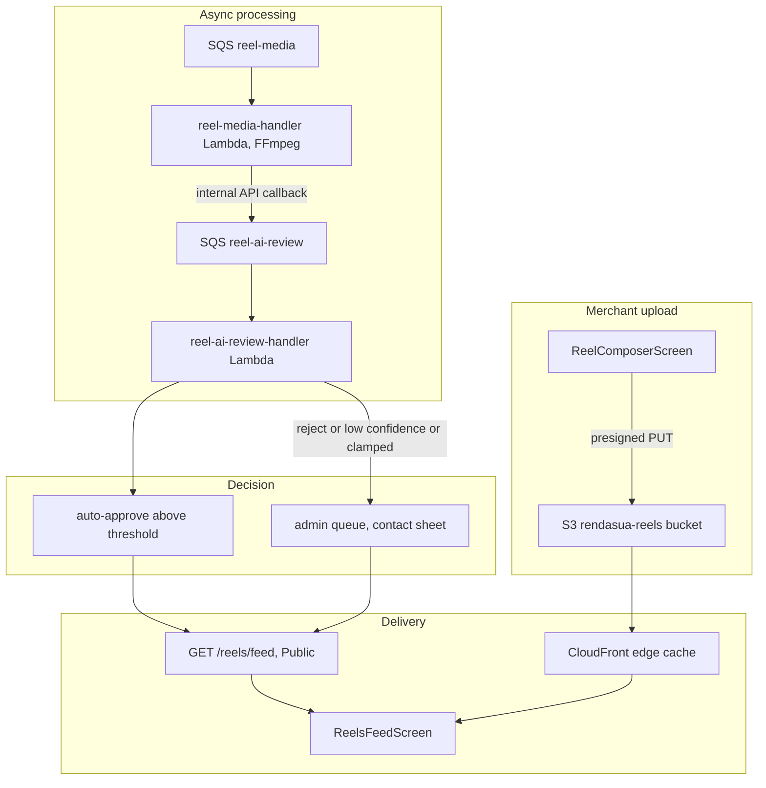

Saved 2026-09-15 from Cursor plan `reels_feature_73cb5ef3`. Todo statuses in the YAML above are a snapshot, not live tracker state.

# Reels Feature and Floating Bottom Nav

## Safety contract

Every phase below obeys these rules. This is the core of the plan, not a footnote.

- **Additive schema only.** New tables and new nullable columns with defaults. No column drops, no type changes, no altered semantics on `items`, `business_inventory`, `orders`, or any existing table. `business_inventory.promotion` is not touched.
- **Additive Hasura permissions only.** New table YAMLs under [apps/hasura/metadata/databases/Rendasua/tables/](apps/hasura/metadata/databases/Rendasua/tables/). Existing table permissions are not edited.
- **Everything client-facing is behind a remote flag, default OFF.** Shipping the code is decoupled from enabling the feature.
- **The nav refactor is split in two.** First a pure extraction that produces byte-identical geometry (no visual change, mergeable alone). Then the restyle behind a flag.
- **Deleted routes become aliases, never deletions.** `ClientFoods` / `GuestFoods` stay registered so existing deep links and push notifications keep working.
- **AI review defaults to disabled**, mirroring `ITEM_AI_AUTO_REVIEW_ENABLED`. The manual queue is the fallback by construction, so a model outage degrades rather than breaks.
- **Merchant allowlist.** Merchants not opted in see zero change.
- Per [.cursor/rules/verify-builds-and-tests.mdc](.cursor/rules/verify-builds-and-tests.mdc): run `nx run-many --target=build --all` and the test targets at the end of every phase.

## Architecture



## Phase 0: client-readable flags

Nothing else can be safely rolled out without this.

[apps/backend/src/admin/configurations.controller.ts](apps/backend/src/admin/configurations.controller.ts) is admin-only, and the mobile app reads no runtime config at all - [apps/mobile/src/config/maintenance.ts](apps/mobile/src/config/maintenance.ts) is a hardcoded constant shipped via OTA.

- Migration inserting flags into `application_configurations`, following the exact pattern of [20260814021100_add_rembg_cleanup_feature_flag](apps/hasura/migrations/Rendasua/20260814021100_add_rembg_cleanup_feature_flag/up.sql): `reels_enabled`, `reels_comments_enabled`, `reels_merchant_allowlist_only`, `floating_nav_enabled`. All `boolean_value` false. The table supports `country_code`, so these can be enabled per market.
- New `AppConfigModule` with a `@Public()` `GET /app-config/client-flags` returning only a hardcoded allowlist of keys. Cached in memory with a short TTL. Never exposes arbitrary config keys.
- Mobile `useClientFlags` hook reading it on startup with a safe default of all-false on failure, and a `ClientFlagsProvider` in [App.tsx](apps/mobile/App.tsx).

## Phase 1: generic content reports and blocks

Standalone, useful before a single reel exists, and required for app-store UGC compliance.

- Migration: `content_reports` with polymorphic `subject_type` (`reel`, `reel_comment`, `sale_item`, `rental_listing`), `subject_id`, `reporter_user_id`, `reason` enum, `details`, `status`, `resolved_by_user_id`, `resolution`. Plus `business_blocks` (content-scoped only; does not affect ordering or refunds).
- `ContentReportsModule`: authenticated submit with per-reporter rate limiting, admin queue, resolve. Auto-hide requires 5 distinct reporters; below that it is manual only, to defeat competitor brigading.
- Admin screens mirroring [AdminItemModerationScreen.tsx](apps/mobile/src/screens/business/AdminItemModerationScreen.tsx) and [AdminItemsModerationPage.tsx](apps/frontend/src/components/pages/AdminItemsModerationPage.tsx).
- Mobile `ReportContentSheet` and `useContentReport`.

## Phase 2: store follows

- Migration: `business_follows` plus `businesses.followers_count`, maintained by trigger exactly as `user_item_likes` maintains `items.likes_count`.
- `BusinessFollowsModule` and a mobile `useBusinessFollow` hook modeled on [useItemLike](apps/mobile/src/hooks/useItemLike.ts), including its guest-to-auth gate via `SaveFavoritesSheet`.

## Phase 3: tab bar geometry extraction (no visual change)

This must merge and be verified on its own. The height math currently exists in six places, including a comment admitting it:

```4:5:apps/mobile/src/hooks/useMainTabContentBottomPadding.ts
/** Height of the floating tab bar overlay (keep in sync with Client/Agent tab navigators). */
export function tabBarOverlayHeight(bottomInset: number): number {
```

- New `src/navigation/tabBarGeometry.ts` exporting `useTabBarGeometry()` and `useTabBarScreenOptions()`, producing values identical to today.
- Refactor all five navigators to consume it: [ClientRootNavigator](apps/mobile/src/navigation/ClientRootNavigator.tsx), [BusinessRootNavigator](apps/mobile/src/navigation/BusinessRootNavigator.tsx), [AgentRootNavigator](apps/mobile/src/navigation/AgentRootNavigator.tsx), [GuestRootNavigator](apps/mobile/src/navigation/GuestRootNavigator.tsx), [DelegateRootNavigator](apps/mobile/src/navigation/DelegateRootNavigator.tsx). Preserve current per-navigator differences (Business and Delegate have no shadow today).
- Point [useMainTabContentBottomPadding.ts](apps/mobile/src/hooks/useMainTabContentBottomPadding.ts) at the new module instead of duplicating the math.
- Fix two pre-existing bugs while here: `BusinessDashboardView` hardcodes `insets.bottom + 100`, and `DelegateMenuTabScreen` has no tab-bar padding at all.
- Acceptance: visually identical on all five personas, iOS and Android.

## Phase 4: floating nav behind flag, Food merged via alias

- Restyle inside `useTabBarScreenOptions()` only, gated on `floating_nav_enabled`: horizontal margins, border radius, elevation, no full-bleed `borderTopWidth`. Flag off returns today's style exactly.
- Label-on-focus: React Navigation cannot vary `tabBarShowLabel` by focus state, so set `tabBarShowLabel: false` and render icon plus conditional label together inside `tabBarIcon` using its `focused` argument. `accessibilityLabel` on every tab regardless.
- Update offsets for [BrowseCartFab](apps/mobile/src/components/browse/BrowseCartFab.tsx), the catalog FABs in `BusinessItemsListScreen` and `BusinessRentalsStudioScreen`, and `TabAwareSnackbar`.
- Food merge: `foodOnly` is a mode threaded through roughly 30 call sites in [BrowseCatalogScreen.tsx](apps/mobile/src/screens/shared/BrowseCatalogScreen.tsx) (suppresses feed stops, FTUE nudge, actions-needed, exports chip; forces category; swaps empty state and hero). Convert it to internal state driven by a segment control, settable via route param.
- Critical: keep `ClientFoods` and `GuestFoods` registered in [types.ts](apps/mobile/src/navigation/types.ts) as hidden alias routes that redirect to Browse with the food segment preselected, so [useAppDeepLinkNavigation.ts:71,80](apps/mobile/src/hooks/useAppDeepLinkNavigation.ts) and [InventoryItemDetailScreen.tsx:313,316](apps/mobile/src/screens/shared/InventoryItemDetailScreen.tsx) keep working. Do not delete the routes.

## Phase 5: media infrastructure

- New `rendasua-reels-{env}` private S3 bucket in [rendasua-infrastructure-stack.ts](apps/cdk/src/lib/rendasua-infrastructure-stack.ts) with lifecycle rules. A separate bucket, because `rendasua-uploads` is managed outside CDK.
- CloudFront distribution with Origin Access Control, long cache TTL. Add `rendasua-uploads` as a second behavior so existing catalog images also get edge caching.
- `reel-media-handler`: FIFO SQS plus Lambda following [imageThumbnailsHandler](apps/cdk/src/lib/rendasua-infrastructure-stack.ts) exactly, but as a container image for FFmpeg, 2GB memory, 5 minute timeout, reserved concurrency 10. Produces faststart MP4, poster frame, and an 8-to-10 frame contact sheet.
- Config keys in [configuration.ts](apps/backend/src/config/configuration.ts) next to `aws.s3BucketName`.

## Phase 6: reels core

- Migration: `reels` (polymorphic over `business_inventory` and `rental_location_listings` via `subject_type`; `generation_source`; `processing_status`; `moderation_status` enum declared with the full value set including `ai_reviewing` and `proposal_pending` even though Phase 6 uses four; `market_country`; `price_at_approval`; nullable `transcript` and `hls_manifest_url` for later; denormalized counters), `reel_likes`, `reel_view_events` with `last_served_at` for the exhaustion cooldown.
- Hasura select permission for `anonymous` and `client` gated on `moderation_status = approved AND is_active AND processing_status = 'ready'`, mirroring [public_items.yaml](apps/hasura/metadata/databases/Rendasua/tables/public_items.yaml).
- `ReelsModule`: merchant CRUD, presigned upload, submit for review, per-merchant daily upload quota, allowlist check. Re-review when the live listing price diverges from `price_at_approval` by more than a configurable 25 percent, reusing the `resubmitIfRejected` shape.
- Sweeper for reels stuck in `processing`, cloned from [item-ai-review-sweeper.service.ts](apps/backend/src/item-ai-review/item-ai-review-sweeper.service.ts).
- Admin queue built for speed: contact sheet first, inline playback on tap, one-tap approve and reject, auto-advance, and a reel-specific version of [QuickRejectionResponses.tsx](apps/mobile/src/components/moderation/QuickRejectionResponses.tsx) (its current chips are all image-specific).

## Phase 7: AI review with manual fallback

Structural clone of [item-ai-review](apps/backend/src/item-ai-review/), which already degrades to the manual queue when disabled or failing.

- Migration: `reel_ai_reviews` mirroring [item_ai_reviews](apps/hasura/migrations/Rendasua/20260711000000_item_moderation_and_ai_review/up.sql), including the `admin_feedback` and `admin_override_action` calibration columns.
- `ReelAiReviewModule` plus `reel-ai-review-handler` Lambda. Model input is the contact sheet plus caption and linked listing. Rubric: does the video show this product, is it watchable, is it policy-clean.
- **Auto-approve only. Never auto-reject.** Reject recommendations are logged and routed to a human. A false auto-approve is recoverable through Phase 1 reporting; a false auto-reject silently burns a merchant.
- Port the `clampDecisionForImageQuality` safety clamp: never auto-approve when probe validation failed, duration is over, no product is detected, or moderation labels trip.
- Config block `reelAiReview` with `enabled` default false, mirroring `itemAiReview`.
- Audio is explicitly out of scope. The composer requires an audio-ownership attestation and offers a mute toggle, and the rubric records that audio was not reviewed.

## Phase 8: the feed and mobile UI

- `ReelsFeedModule` with ranking in a Postgres function: market scoping with out-of-market shown as non-purchasable, merchant round-robin, seen-state exclusion, follow boost. **Session-stable pagination** - build the ranked ID list once per session, cache it in [CatalogCacheModule](apps/backend/src/catalog-cache/) Redis, and paginate the frozen list. Recording views must not mutate the live cursor.
- End-of-feed card routing to catalog, with reels eligible again after a cooldown.
- Add `react-native-reanimated`, `expo-video`, `expo-camera`, `expo-file-system`, `react-native-compressor`. Note `expo-av` was removed in SDK 55, and use `generateThumbnailsAsync` from `expo-video` rather than the deprecated `expo-video-thumbnails`.
- Player lifecycle: one active player, one pre-warmed next player built without mounting a view, `player.replace()` on scroll, `useCaching: true`, mandatory pause on blur and background. Never mount one player in two `VideoView`s on Android.
- Components under `src/components/reels/`: `ReelPlayer`, `ReelOverlay`, `ReelActionRail`, `ReelMerchantRow`, `ReelProductPill`, `ReelBuySheet`, `ReelMoreSheet`. The action rail wraps the existing `useItemLike`-shaped hook and [usePageShare](apps/mobile/src/hooks/usePageShare.ts) rather than reimplementing either.
- Buy opens a bottom sheet over the paused video reusing [useCatalogVariantFlow](apps/mobile/src/hooks/useCatalogVariantFlow.ts), so variants and add-to-cart behave identically to catalog and the feed never loses position.
- Tabs, all gated on `reels_enabled`: `ClientReels` and `GuestReels` in the freed Food slot, `BusinessReels` bringing Business to five. Agent stays at four, Delegate at two. Merchant tab opens the same public feed with a create FAB and a My Reels entry. Immersive mode hides the tab bar using the `display: 'none'` pattern already in [GuestRootNavigator.tsx:31](apps/mobile/src/navigation/GuestRootNavigator.tsx).
- Client-side compression enforced to H.264, 720p max, 30s max, 10MB max, 2Mbps max, with server-side revalidation.
- Web scoped to an embedded player on item detail and store pages plus a simple mobile-web feed. Desktop reels is a separate design task.
- New `SITE_EVENT_TYPES_V1` entries in [site-event-types.ts](apps/backend/src/site-events/site-event-types.ts) for the reel funnel. A view is 3 seconds watched, deduped per user per day; attribution window is 24 hours from buy-click. Both fixed now, since changing them later invalidates merchant history.

## Phase 9: notifications and the merchant nudge

- Four types in [notification-types.ts](apps/backend/src/notifications/notification-types.ts) plus a `reel-push.messages.ts` alongside `rental-push.messages.ts`: merchant engagement on their reel, moderation approved or rejected, new reel from a followed store, merchant reply to a commenter. Deep-link cases in [deep-link.service.ts](apps/backend/src/notifications/deep-link.service.ts), including a graceful state for a removed reel.
- Follower fan-out capped at one per store per day with its own key in [notification-preference.service.ts](apps/backend/src/notifications/orchestration/notification-preference.service.ts).
- Merchant nudge goes in `buildReadinessSteps()` in [businessStoreReadiness.ts](apps/mobile/src/utils/businessStoreReadiness.ts) - the post-go-live readiness card that already carries logo, hours, and ten-products. Needs a reel count in `DashboardAggregatesDto` via `getStoreReadinessSignals()`. Plus one `push_first_reel` in [merchant-engagement-eligibility.ts](apps/backend/src/merchant-engagement/merchant-engagement-eligibility.ts) with a long cooldown. Deliberately **not** also in `resolveMerchantTip()`. Both gated on allowlist eligibility.
- Not `BusinessSetupChecklist` - reels must never block go-live.

## Phase 10: comments behind flag

- Migration: `reel_comments` with one level of replies, `is_hidden`, `is_pinned`, `moderation_status`. `content_reports.subject_type` already includes `reel_comment` from Phase 1.
- `ReelCommentsModule` with contact-info stripping before a comment is ever visible - this is the disintermediation guard, since public comments on a commission marketplace are the most efficient possible channel for moving deals off-platform. Merchant can hide any comment on their own reel. Rate limited. Heuristics carry the load here because models handle Cameroonian Pidgin poorly.
- `ReelCommentsSheet` and `useReelComments`, gated on `reels_comments_enabled`, enabled a week or two after the feed.

## Phase 11: insights, then boost credits

- Merchant reel insights screen from the Phase 8 site events. This must exist before charging for reach.
- **Cost model first.** Roughly 100k views a month at 8MB is about 800GB, and CloudFront Africa and Middle East pricing runs well above North America. That number sets boost pricing and nobody has it yet.
- `reel_boosts` and `business_reel_credit_usage` migration, and a `ReelBoostsModule` closely following [business-tokens.service.ts](apps/backend/src/business-tokens/business-tokens.service.ts) - same `PaymentRoutingService` Stripe-or-MoMo split, same `{ CAD, XAF }` pack shape, same decrement-then-refund-on-failure guard. Consumable credits, not a subscription, since nothing in the stack does recurring billing and MoMo has no recurring mandate.

## Cross-cutting

- Bilingual `en.json` and `fr.json` keys with defaults throughout, per the translation rules.
- A `reels` topic in [apps/backend/src/assistant/knowledge/](apps/backend/src/assistant/knowledge/) in both languages, per [assistant-knowledge-base.mdc](.cursor/rules/assistant-knowledge-base.mdc).
- Reel content and music-ownership terms in the merchant agreement with a `merchant_agreement_version` bump.
- Vector illustrations for the composer empty state and the why-post-reels explainer, per [vector-illustrations.mdc](.cursor/rules/vector-illustrations.mdc).
- Small fixture videos committed for tests.

## Rollback

Each layer disables independently without a store release: `reels_enabled` off hides all tabs and the feed; `floating_nav_enabled` off restores the exact current nav; `reelAiReview.enabled` off routes everything to the manual queue; the allowlist empty removes merchant exposure. No migration needs reverting to disable the feature, because nothing existing was modified.

## Open items not blocking start

- Who staffs the moderation queue when auto-approve confidence is low.
- The egress cost model, needed before Phase 11 pricing.
- Whether to validate AI-generated reels with a handful of hand-made examples shown to merchants before building that path, since it is the highest-leverage and least-proven part of the feature.